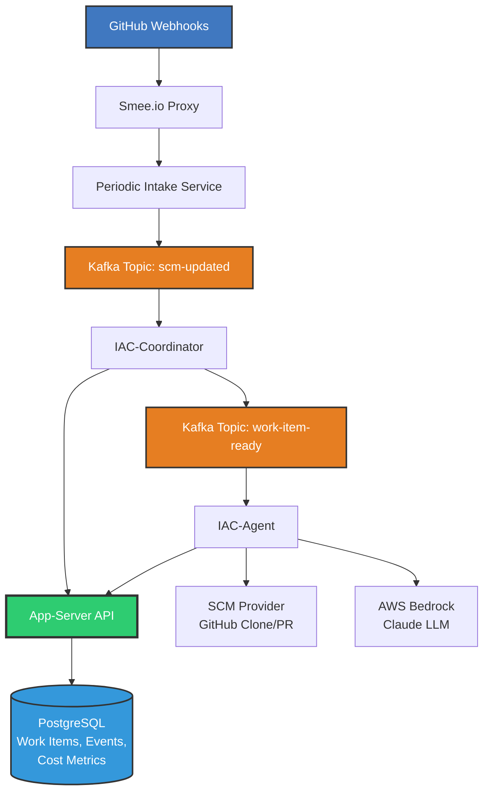

# Summary

This RFC proposes the overall system architecture for the IAC Agent platform, which will automatically process GitHub webhook events to perform infrastructure-as-code (IAC) analysis and remediation using AI agents. The system uses Smee.io for webhook ingestion, Kafka for event streaming, and two specialized Python services (IAC-Coordinator and IAC-Agent) for orchestration and remediation.

# Motivation

We need an automated system that can:
- Receive and process GitHub webhook events (PRs, comments, issues) for IAC repositories
- Coordinate work items and associate them with GitHub entities
- Execute AI-powered analysis and remediation of IAC code
- Resume work sessions reliably across service restarts
- Support integration testing with simulated events

The system should be modular, scalable, and easy to test locally using Docker Compose.

# Detailed Design

## System Overview

The IAC Agent platform consists of five main components:



**Key Principles**:
- Both IAC-Coordinator and IAC-Agent communicate with app-server API for all data operations
- No direct database access from services
- Kafka topics provide event-driven architecture with replay capability

### 1. Webhook Ingestion (Smee.io)

**Purpose**: POC endpoint to queue GitHub webhooks without requiring public URLs

- Smee.io acts as a webhook proxy and queue
- GitHub webhooks are sent to a Smee.io channel URL
- Events are buffered and can be retrieved via SSE (Server-Sent Events)

### 2. Periodic Intake Service

**Purpose**: Pull events from Smee.io and push to Kafka

**Responsibilities**:
- Poll Smee.io channel on a configurable interval (e.g., every 30 seconds)
- Deduplicate events based on GitHub delivery ID
- Transform Smee payload format to normalized event structure
- Publish events to Kafka topic: `scm-updated`
- Log ingestion metrics and errors

**Technology**: Python service with `smee-client` library or HTTP SSE client

### 3. Apache Kafka (Event Bus)

**Purpose**: Reliable event streaming and work queue

**Topics**:
- `scm-updated`: SCM provider events (GitHub, GitLab, etc.) from intake service
- `work-item-ready`: Work assignments ready for agent processing (bounded, single unit of work)

**Configuration**:
- Run via Docker Compose with Zookeeper
- Single partition for ordered processing (POC), can scale later
- Retention: 7 days for replay capability
- Consumer groups for each service

**Event Schemas**:

All Kafka topics use Pydantic schemas for automatic validation and type safety. The schema directory follows a one-to-one mapping between topic names and schema modules:

```text
schemas/
├── __init__.py
├── scm_updated.py        # Schema for scm-updated topic
└── work_item_ready.py    # Schema for work-item-ready topic
```

Each schema module defines:
- **Message Model**: Pydantic model for the event payload
- **Validation Rules**: Field validators and constraints
- **Examples**: Sample payloads for testing
- **Version**: Schema version for evolution tracking

### Example: scm-updated Topic Schema

```python
# schemas/scm_updated.py
from pydantic import BaseModel, Field
from typing import Literal, Optional, Dict, Any
from datetime import datetime

class SCMUpdatedEvent(BaseModel):
    """Schema for scm-updated topic - inbound SCM provider events."""

    event_id: str = Field(..., description="Unique event identifier (e.g., GitHub delivery ID)")
    event_type: Literal["pull_request", "issue_comment", "pull_request_review", "push"]
    provider: Literal["github", "gitlab", "bitbucket"]
    timestamp: datetime
    repository: str = Field(..., description="Full repository name (owner/repo)")

    # Event-specific payload
    payload: Dict[str, Any] = Field(..., description="Provider-specific event payload")

    # Metadata
    metadata: Dict[str, Any] = Field(
        default_factory=dict,
        description="Additional metadata (smee_channel, ingested_at, etc.)"
    )

    class Config:
        schema_version = "1.0.0"

    class ConfigDict:
        json_schema_extra = {
            "examples": [
                {
                    "event_id": "12345678-1234-1234-1234-123456789012",
                    "event_type": "pull_request",
                    "provider": "github",
                    "timestamp": "2025-11-03T12:00:00Z",
                    "repository": "myorg/myrepo",
                    "payload": {
                        "action": "opened",
                        "number": 123,
                        "pull_request": {"title": "Fix security issue"}
                    },
                    "metadata": {"smee_channel": "https://smee.io/abc123"}
                }
            ]
        }
```

### Example: work-item-ready Topic Schema

```python
# schemas/work_item_ready.py
from pydantic import BaseModel, Field
from typing import Literal, Optional, Dict, Any
from datetime import datetime

class WorkItemReadyEvent(BaseModel):
    """Schema for work-item-ready topic - work assignments for agent processing.

    Each message represents a bounded unit of work scoped to a single agent execution.
    The work may involve multiple LLM calls but is tightly bounded to one session.
    """

    work_item_id: int = Field(..., description="Database work item ID")
    session_id: str = Field(..., description="Unique session identifier (e.g., myrepo-pr-123)")
    item_type: Literal["issue", "pull_request", "review", "comment"]
    item_number: int = Field(..., description="GitHub issue/PR number")
    repository: str = Field(..., description="Full repository name (owner/repo)")

    # Work context
    context: Dict[str, Any] = Field(
        ...,
        description="Work context including title, body, author, trigger event"
    )

    # Branch information (if resuming)
    branch_name: Optional[str] = Field(None, description="Existing branch to resume from")

    # Metadata
    created_at: datetime
    source_event_id: str = Field(..., description="SCM event that triggered this work")

    class Config:
        schema_version = "1.0.0"

    class ConfigDict:
        json_schema_extra = {
            "examples": [
                {
                    "work_item_id": 42,
                    "session_id": "myrepo-pr-123",
                    "item_type": "pull_request",
                    "item_number": 123,
                    "repository": "myorg/myrepo",
                    "context": {
                        "title": "Fix security vulnerability in terraform config",
                        "body": "Updates AWS S3 bucket to enable encryption...",
                        "author": "developer123",
                        "action": "opened"
                    },
                    "branch_name": None,
                    "created_at": "2025-11-03T12:01:00Z",
                    "source_event_id": "12345678-1234-1234-1234-123456789012"
                }
            ]
        }
```

**Benefits**:
- Automatic validation at producer and consumer
- Type safety and IDE autocomplete
- Self-documenting event structure
- Version tracking for schema evolution
- Clear examples for testing and documentation

### 4. IAC-Coordinator Service

**Purpose**: Process GitHub events and create work items

**Responsibilities**:
- Consume from `scm-updated` Kafka topic
- Parse SCM provider events (pull_request, issue_comment, pull_request_review_comment)
- Apply business logic to determine if work is needed
- Communicate with app-server API to create/update work items
- Generate session identifiers (format: `{repo}-{type}-{number}`)
- Publish work item notifications to `work-item-ready` Kafka topic
- Associate comments and PRs with existing work items
- Track work item state transitions via app-server

**App-Server Integration**:

The coordinator does NOT directly access the database. Instead, it communicates with the app-server API:
- `POST /api/work-items` - Create new work item
- `PATCH /api/work-items/{id}` - Update work item status
- `GET /api/work-items?repo={repo}&number={number}` - Query existing work items

The app-server maintains:
- Work items table with status, repository, item_number, item_type
- PR/Issue mappings for session continuity
- Event deduplication table

**Technology**: Python service with `kafka-python` or `confluent-kafka`

### 5. IAC-Agent Service

**Purpose**: Execute AI-powered IAC analysis and remediation

**Responsibilities**:
- Consume from `work-item-ready` Kafka topic
- Set up execution environment (credentials, git clone)
- Run pre-flight LLM prompt to extract work items and personas
- Execute LLM pipeline for IAC analysis/remediation
- Commit changes and create pull requests
- Update work item status via app-server API
- Support session resumption from stored state

**Technology**: Python service with AWS Bedrock SDK and GitPython

**App-Server Integration**:

The agent does NOT directly access the database. Instead, it communicates with the app-server API:
- `PATCH /api/work-items/{id}/status` - Update work item status (in_progress, completed, failed)
- `GET /api/work-items/{id}` - Retrieve work item details and context
- `POST /api/work-items/{id}/events` - Log agent events and progress

**State Management**:
- In-memory session state during execution
- On-disk git working directory
- Work item status and session metadata managed by app-server
- No persistent agent state beyond work item records

## Data Flow

### Event Processing Flow

1. **GitHub Event** → Smee.io channel
2. **Periodic Intake** polls Smee.io → publishes to `scm-updated` topic
3. **IAC-Coordinator** consumes `scm-updated`:
   - Calls app-server API to create or update work item
   - Publishes to `work-item-ready` topic
4. **IAC-Agent** consumes `work-item-ready`:
   - Checks if work item already in progress (deduplication)
   - Sets up environment and clones repository
   - Runs LLM pipeline
   - Calls app-server API to update work item status to `completed` or `failed`

### Session Identifier Generation

Format: `{repo_name}-{item_type}-{item_number}`

Examples:
- `myrepo-pr-123`
- `terraform-infra-issue-45`
- `myrepo-comment-pr-67`

This matches the claude-auto pattern for session naming.

### Work Item Lifecycle

States: `queued` → `in_progress` → `completed` | `failed` | `paused`

```text
queued:      Work item created from GitHub event
in_progress: IAC-Agent has started processing
paused:      Waiting for user input or external event
completed:   Successfully finished
failed:      Error occurred during processing
```

## Component Interactions

### Coordinator → App-Server

The coordinator communicates with the app-server API to:
- Create new work items via `POST /api/work-items`
- Query existing work items via `GET /api/work-items`
- Update work item status via `PATCH /api/work-items/{id}`

The app-server maintains:
- Work items with current status
- Event deduplication (by SCM delivery ID)
- PR/Issue mappings to work items for context reuse
- Session metadata (branch, pr_number, timestamps)

### Agent → App-Server

The agent communicates with the app-server API to:
- Retrieve work item details via `GET /api/work-items/{id}`
- Update work item status via `PATCH /api/work-items/{id}/status`
- Log agent progress via `POST /api/work-items/{id}/events`

### Agent → SCM Provider

The agent uses a pluggable SCM provider abstraction (see ADR-004):
- Interface: `SCMProvider` with methods: `clone()`, `create_branch()`, `commit()`, `create_pr()`
- Implementations: `GitHubSCMProvider` (real), `MockSCMProvider` (testing)
- Configuration: `GITHUB_TOKEN` and `SCM_PROVIDER` environment variables

### Agent → Bedrock LLM

The agent uses AWS Bedrock for LLM access (see ADR-005):
- Configurable model (default: Claude 3.7 Sonnet)
- Pre-flight prompt to extract work items and determine personas
- Multi-turn conversation for analysis and remediation
- Structured output parsing for actionable results

## Testing Strategy

### Integration Testing

**Pydantic Schema Validation**:

All events are automatically validated using the Pydantic schemas defined in the `schemas/` directory. This ensures:
- Type safety at producer and consumer
- Automatic validation of required fields
- Clear error messages for invalid payloads
- Self-documenting event structure

**Helper Script**: `tools/build-event-schema.py`

Purpose: Analyze real events from Smee and generate:
1. Pydantic schema updates from observed events
2. Event simulator that generates realistic test events
3. Test fixtures based on Pydantic models

Usage:

```bash
# Analyze events and update Pydantic schemas
python tools/build-event-schema.py --source smee --update schemas/

# Generate test events using Pydantic models
python tools/simulate-events.py --count 10 --topic scm-updated

# Validate event payload against schema
python -m schemas.scm_updated validate event.json
```

### Docker Compose Testing

```yaml
services:
  zookeeper: ...
  kafka: ...
  postgres: ...
  iac-routerinator: ...
  iac-agent: ...
  smee-intake: ...
```

This allows full end-to-end testing locally with simulated GitHub events.

## Configuration

### Environment Variables

**Smee Intake**:
- `SMEE_CHANNEL_URL`: Smee.io channel URL
- `KAFKA_BOOTSTRAP_SERVERS`: Kafka connection
- `POLL_INTERVAL_SECONDS`: How often to poll Smee (default: 30)

**IAC-Coordinator**:
- `KAFKA_BOOTSTRAP_SERVERS`: Kafka connection
- `KAFKA_INPUT_TOPIC`: Input topic (default: `scm-updated`)
- `KAFKA_OUTPUT_TOPIC`: Output topic (default: `work-item-ready`)
- `APP_SERVER_URL`: App-server API base URL (e.g., `http://app-server:8000`)
- `APP_SERVER_API_KEY`: Authentication token for app-server API
- `GITHUB_TOKEN`: For API calls to fetch PR/issue details

**IAC-Agent**:
- `KAFKA_BOOTSTRAP_SERVERS`: Kafka connection
- `KAFKA_WORK_ITEMS_TOPIC`: Work items topic (default: `work-item-ready`)
- `APP_SERVER_URL`: App-server API base URL (e.g., `http://app-server:8000`)
- `APP_SERVER_API_KEY`: Authentication token for app-server API
- `GITHUB_TOKEN`: For git operations and PR creation
- `SCM_PROVIDER`: Provider type (default: `github`)
- `AWS_REGION`: Bedrock region
- `BEDROCK_MODEL_ID`: Model to use (default: `anthropic.claude-3-7-sonnet-20250219`)
- `WORK_DIR`: Directory for git clones (default: `/tmp/iac-agent`)

## Session Resumption

The system supports resuming work from any point:

1. **Trigger**: New event for existing work item
2. **Lookup**: Coordinator queries app-server to find existing work item by repo + item_number via `GET /api/work-items?repo={repo}&number={number}`
3. **Status Check**:
   - If `completed`: Create new work item for follow-up
   - If `in_progress`: Agent can resume from previous state
   - If `paused`: Agent resumes from last checkpoint
4. **Context**: Agent retrieves previous work context from app-server via `GET /api/work-items/{id}`

App-server provides:
- Last branch name
- Last commit SHA
- Previous conversation log
- Work item context JSON
- Cost metrics and token usage history

Agent can:
- Resume from existing git clone (if still present)
- Or re-clone and checkout branch
- Continue LLM conversation with previous context

# Drawbacks

## Complexity
- Multiple services and Kafka add operational overhead
- POC uses Smee.io which is not production-ready

## State Management
- Relying on database for all state may have latency implications
- Git working directories on disk may accumulate if not cleaned up

## Scalability Limitations
- Single Kafka partition limits parallelism
- Smee.io may have rate limits or reliability issues

# Alternatives

## Alternative 1: Direct Webhook Processing

**Description**: Run a public webhook endpoint instead of Smee.io

**Pros**:
- More direct, less moving parts
- Production-ready approach

**Cons**:
- Requires public URL and TLS setup
- Harder to test locally
- Need webhook signature verification

**Decision**: Use Smee.io for POC, migrate to direct webhooks later

## Alternative 2: Monolithic Service

**Description**: Combine coordinator and agent into single service

**Pros**:
- Simpler deployment
- Fewer inter-service dependencies

**Cons**:
- Harder to scale independently
- Mixing concerns (orchestration vs execution)
- Difficult to test in isolation

**Decision**: Keep services separated for clarity and testability

## Alternative 3: Use Redis Instead of Kafka

**Description**: Use Redis Streams or pub/sub for event queue

**Pros**:
- Simpler to set up
- Lower resource usage

**Cons**:
- Less robust delivery guarantees
- Weaker replay capabilities
- Not as scalable

**Decision**: Use Kafka for production-grade event streaming

# Adoption Strategy

## Phase 1: Core Infrastructure (Week 1-2)
- Set up Docker Compose with Kafka and PostgreSQL
- Implement Smee intake service
- Create database schema and migrations
- Build event schema analyzer tool

## Phase 2: Coordinator Service (Week 3-4)
- Implement GitHub event parsing
- Build work item creation logic
- Add session identifier generation
- Create basic UI/API for viewing work items

## Phase 3: Agent Service (Week 5-6)
- Implement SCM provider abstraction
- Build Bedrock LLM integration
- Create pre-flight prompt system
- Add git operations and PR creation

## Phase 4: Testing & Refinement (Week 7-8)
- Build event simulator
- Create integration tests
- Add monitoring and logging
- Performance tuning

# Unresolved Questions

1. **Error Handling**: What should happen if LLM returns invalid/unsafe code?
   - **Proposed**: Add validation persona that processes all commits before submitting to SCM provider. This persona will:
     - Review code changes for security vulnerabilities
     - Check for syntax errors and linting issues
     - Validate against infrastructure best practices
     - Provide feedback to the main agent for corrections if needed

2. **Rate Limiting**: How do we handle GitHub API rate limits?
   - Proposed: Add exponential backoff and queue prioritization

3. **Concurrent Work Items**: Can multiple agents work on same repository simultaneously?
   - **Proposed**: The coordinator is responsible for querying the app-server API to determine concurrency limits on a repository. The app-server will:
     - Maintain a registry of active work items per repository
     - Enforce concurrency limits based on repository configuration
     - Provide an API endpoint for the coordinator to check if a new work item can be processed
     - Handle distributed locking across multiple coordinator instances

4. **Event Replay**: How far back should we support replaying events?
   - Proposed: 7 day retention, configurable

5. **Cost Control**: How do we limit Bedrock LLM costs during testing?
   - **Proposed**: Add fine-grained cost metrics and session status tracking:
     - Agent reports token usage per LLM call to app-server via `POST /api/work-items/{id}/costs`
     - App-server provides cost metrics API at `GET /api/metrics/costs` with filters for:
       - Time period (hourly, daily, weekly)
       - Work item status
       - Repository
       - Agent instance
     - Implement budget alerts and limits:
       - Max tokens per work item (configurable)
       - Daily/weekly cost thresholds
       - Automatic pause when limits exceeded

# Future Possibilities

1. **Multi-Cloud Support**: Support Azure, GCP IAC in addition to AWS
2. **Advanced Personas**: Add specialized personas for different IAC frameworks
3. **Human-in-the-Loop**: Add approval workflow before creating PRs
4. **Metrics Dashboard**: Real-time monitoring of work items and agent performance
5. **Auto-scaling**: Scale IAC-Agent instances based on queue depth
6. **Policy Engine**: Pluggable policy checks before code modifications
7. **Direct Webhooks**: Replace Smee.io with production webhook endpoint
