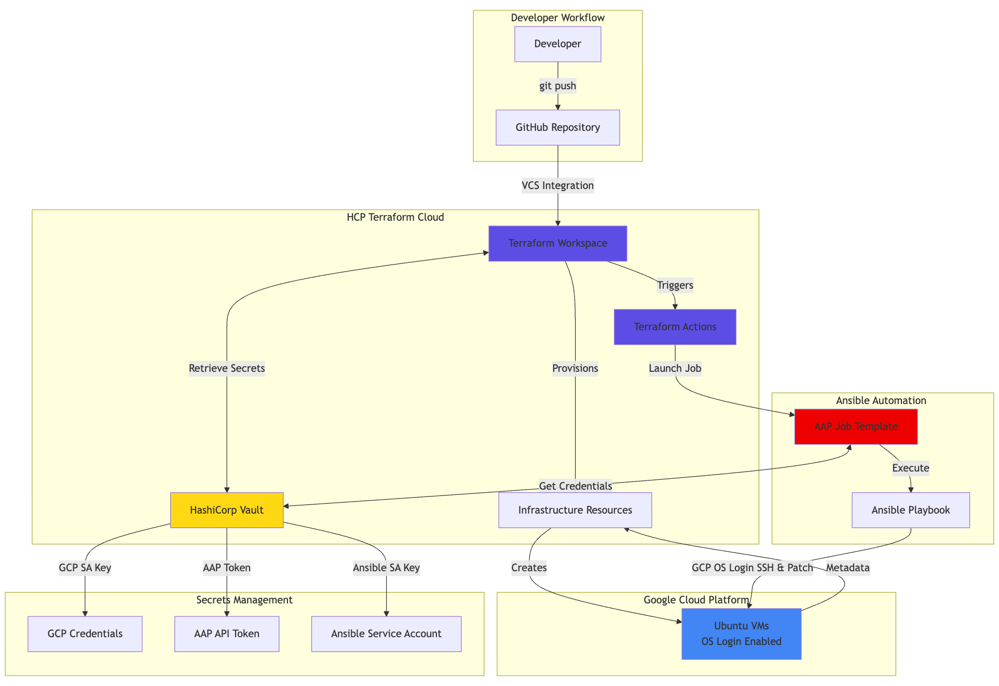

# Terraform Actions for Day-2 Operations with Ansible

Production-ready solution for automating VM patching using **Terraform Actions**, **Ansible Automation Platform**, and **HashiCorp Vault** with **GCP OS Login**.

## Overview

Automatically trigger Ansible patching jobs when VMs are created or updated. All credentials managed through Vault, SSH access via GCP OS Login (IAM-based, no key management on VMs).

### Key Features

- ✅ Automated VM provisioning and patching
- ✅ GCP OS Login for IAM-based SSH access
- ✅ Dynamic inventory from Terraform state
- ✅ Secure credential management via Vault
- ✅ Production-ready with comprehensive tests

### Architecture



---

## Quick Start

### 1. Prerequisites

- GCP Project with billing
- HCP Terraform workspace
- HCP Vault cluster
- Ansible Automation Platform
- Tools: [gcloud](https://cloud.google.com/sdk/docs/install), [terraform](https://www.terraform.io/downloads), [vault](https://www.vaultproject.io/downloads)

### 2. Configure HCP Terraform

Set workspace variables:

**Terraform Variables:**
- `vault_addr`, `aap_hostname`, `aap_job_template_id`, `gcp_project_id`, `ansible_user`

**Environment Variables:**
- `VAULT_TOKEN` (sensitive), `VAULT_NAMESPACE`

### 3. Setup Vault Secrets

```bash
vault kv put secret/gcp/service-account @service-account.json
vault kv put secret/aap/api-token token="your-token"
```

### 4. Setup SSH Access (One-time)

After first `terraform apply`:

```bash
cd terraform

# Add SSH key to your OS Login
terraform output -raw ansible_ssh_public_key > /tmp/key.pub
gcloud compute os-login ssh-keys add --key-file=/tmp/key.pub
rm /tmp/key.pub

# Get your OS Login username
YOUR_USERNAME=$(gcloud compute os-login describe-profile --format="value(posixAccounts[0].username)")

# Store in Vault
terraform output -raw ansible_ssh_private_key > /tmp/key.pem
vault kv put secret/ssh/ansible-gcp username="$YOUR_USERNAME" ssh_key_data=@/tmp/key.pem
rm /tmp/key.pem
```

### 5. Configure AAP

1. **Update HCP Terraform variable**: Set `ansible_user` to your OS Login username from step 4
2. **Update AAP Credential**: Resources → Credentials → Edit SSH credential
   - Username: Your OS Login username
   - SSH Private Key: `terraform output -raw ansible_ssh_private_key`
3. **Sync Project**: Resources → Projects → Your Project → Click Sync

### 6. Test

```bash
git commit --allow-empty -m "Test automation"
git push origin main
```

Monitor: HCP Terraform → AAP Jobs → Verify VMs patched

---

## Configuration

### Key Variables

```hcl
vm_count            = 5                    # Number of VMs
vm_machine_type     = "e2-medium"          # GCP machine type
aap_job_template_id = 11                   # AAP template ID
ansible_user        = "your_username_com"  # OS Login username
```

### Vault Secrets

| Path | Keys | Description |
|------|------|-------------|
| `secret/gcp/service-account` | (JSON) | GCP credentials for Terraform |
| `secret/aap/api-token` | `token` | AAP API token |
| `secret/ssh/ansible-gcp` | `username`, `ssh_key_data` | SSH credentials |

### AAP Job Template Requirements

- **Playbook**: `ansible/gcp_vm_patching_demo.yml`
- **Variables**: ✅ Prompt on launch (required!)
- **Credentials**: Machine credential with SSH key

---

## Usage

### Deploy Infrastructure

```bash
# VCS-driven (recommended)
git add terraform/
git commit -m "Update infrastructure"
git push origin main
```

### Automatic Patching

Terraform Actions automatically trigger AAP after VM creation/updates. No manual intervention needed.

### Monitor

1. **HCP Terraform**: Infrastructure changes
2. **AAP UI**: Job execution and output
3. **GCP Console**: VM status

---

## Testing

```bash
task test              # Run all tests
task test-terraform    # Terraform validation
task test-ansible      # Ansible syntax
task test-python       # Property-based tests
```

---

## Troubleshooting

### 1. Playbook Changes Not Reflected in AAP

**Symptom**: Updated playbook but AAP still runs old version

**Solution**: 
```bash
# Sync AAP project after any playbook changes
# AAP UI → Resources → Projects → Your Project → Click Sync button
```

**When to sync**:
- After initial setup
- After any playbook changes
- Before demos
- When troubleshooting unexpected behavior

---

### 2. SSH Connection Fails - Permission Denied (publickey)

**Symptom**: `FAILED - RETRYING: [ubuntu-vm-X]: Wait for SSH (3 retries left)`

**Root Causes**:
1. SSH key not added to OS Login profile
2. Wrong username in Vault or AAP credential
3. SSH key mismatch between Terraform output and Vault

**Solution**:

```bash
# Step 1: Verify SSH key is registered in OS Login
gcloud compute os-login ssh-keys list

# Step 2: If not listed, add the Terraform-generated key
cd terraform
terraform output -raw ansible_ssh_public_key > /tmp/key.pub
gcloud compute os-login ssh-keys add --key-file=/tmp/key.pub
rm /tmp/key.pub

# Step 3: Get your OS Login username
YOUR_USERNAME=$(gcloud compute os-login describe-profile --format="value(posixAccounts[0].username)")
echo "Your OS Login username: $YOUR_USERNAME"

# Step 4: Update Vault with correct username and SSH key
terraform output -raw ansible_ssh_private_key > /tmp/key.pem
vault kv put secret/ssh/ansible-gcp \
  username="$YOUR_USERNAME" \
  ssh_key_data=@/tmp/key.pem
rm /tmp/key.pem

# Step 5: Update HCP Terraform variable
# Set ansible_user = "your_username_com" in workspace variables

# Step 6: Update AAP credential
# Resources → Credentials → Edit SSH credential
# - Username: your_username_com
# - SSH Private Key: terraform output -raw ansible_ssh_private_key

# Step 7: Test manually
VM_IP=$(terraform output -json vm_external_ips | jq -r '.[0]')
ssh $YOUR_USERNAME@$VM_IP
```

---

### 3. Empty Inventory in AAP / No Hosts Found

**Symptom**: AAP job runs but skips all tasks, no VMs in inventory

**Root Causes**:
1. "Prompt on launch" not enabled for Variables in job template
2. Terraform Actions not passing `extra_vars` correctly
3. AAP job template ID mismatch

**Solution**:

```bash
# Check AAP job template settings
# 1. AAP UI → Resources → Templates → Your Template → Edit
# 2. Under "Variables": Enable "Prompt on launch" checkbox
# 3. Save template

# Verify extra_vars in AAP job output
# Should see: "extra_vars": {"inventory": {...}}

# Check Terraform Actions configuration
cd terraform
grep -A 5 "aap_job_template_id" actions.tf
# Verify ID matches your AAP template
```

---

### 4. Vault Connection Errors - Permission Denied

**Symptom**: `Error making API request. Code: 403. Errors: * permission denied`

**Root Causes**:
1. Invalid or expired Vault token
2. Wrong Vault namespace
3. Insufficient permissions on secret paths

**Solution**:

```bash
# Step 1: Verify Vault connection
vault status

# Step 2: Login to Vault
vault login

# Step 3: Set correct namespace
export VAULT_NAMESPACE=admin

# Step 4: Test secret access
vault kv get secret/ssh/ansible-gcp
vault kv get secret/aap/api-token
vault kv get secret/gcp/service-account

# Step 5: Update HCP Terraform environment variables
# VAULT_TOKEN (sensitive)
# VAULT_NAMESPACE = admin
```

---

### 5. AAP Credential Not Found in Template

**Symptom**: Cannot select SSH credential in AAP job template dropdown

**Root Causes**:
1. Credential type mismatch (looking for "Machine" but only "HashiCorp Vault Secret Lookup" available)
2. Credential not created or misconfigured

**Solution**:

```bash
# AAP UI → Resources → Credentials → Create Credential

# For SSH Credential:
# - Name: GCP Ubuntu SSH Key
# - Credential Type: Machine (or SSH if Machine not available)
# - Username: your_username_com
# - SSH Private Key: Paste from terraform output -raw ansible_ssh_private_key

# For Vault Credential (if using Vault lookup):
# - Name: aap-gcp-vm-vault
# - Credential Type: HashiCorp Vault Secret Lookup
# - Server URL: https://vault-cluster-public-vault-xxx.hashicorp.cloud:8200
# - Token: Your Vault token
# - API Version: v2
# - Path to Secret: ssh/ansible-gcp
# - Key Name: ssh_key_data

# Then in Job Template:
# - Credentials: Select "GCP Ubuntu SSH Key"
```

---

### 6. Localhost Shows as "changed" in PLAY RECAP

**Symptom**: `localhost : ok=2 changed=1` even though no changes made

**Root Cause**: `add_host` task always shows as changed

**Solution**: Already fixed in playbook with `changed_when: false`

```yaml
- name: Add hosts to dynamic inventory
  add_host:
    name: "{{ item.key }}"
    # ... other params
  changed_when: false  # Prevents showing as changed
```

---

### 7. Patch Details Not Showing in AAP Output

**Symptom**: Only see "changed: [ubuntu-vm-X]" but no package details

**Root Cause**: Playbook not capturing or displaying package information

**Solution**: Already fixed in playbook with detailed output tasks:

```yaml
# Pre-patch: Shows available updates
- name: Show available security updates
  debug:
    msg: "=== SECURITY UPDATES AVAILABLE ==="

# During patch: Captures apt output
- name: Upgrade security packages
  apt:
    upgrade: dist
  register: apt_upgrade_result

# Post-patch: Extracts and displays upgraded packages
- name: Extract upgraded packages
  set_fact:
    upgraded_packages: "{{ apt_upgrade_result.stdout_lines | select('match', '^Unpacking') | list }}"
```

---

### 8. VMs Not Ready After Creation (SSH Timeout)

**Symptom**: SSH connection fails immediately after VM creation

**Root Cause**: VMs need time to boot and start SSH service

**Solution**: Already configured with optimal timeouts:

```hcl
# terraform/main.tf
resource "time_sleep" "wait_for_vms" {
  create_duration = "120s"  # Wait 2 minutes for VMs to boot
}

# ansible/gcp_vm_patching_demo.yml
- name: Wait for SSH
  wait_for_connection:
    timeout: 180        # 3 minutes total
    delay: 10           # Start checking after 10s
    sleep: 5            # Check every 5s
  retries: 3            # Retry 3 times
```

---

### 9. Wrong Job Template ID in Terraform Actions

**Symptom**: Terraform Actions trigger wrong AAP job or fail with 404

**Root Cause**: Job template ID changed or deleted in AAP

**Solution**:

```bash
# Step 1: Get correct job template ID from AAP
# AAP UI → Resources → Templates → Your Template
# URL will show: /templates/job_template/11/details
# ID is 11 in this example

# Step 2: Update terraform/terraform.tfvars
aap_job_template_id = 11

# Step 3: Update HCP Terraform workspace variable
# aap_job_template_id = 11

# Step 4: Commit and push
git add terraform/terraform.tfvars
git commit -m "Update AAP job template ID"
git push origin main
```

---

### 10. ansible_user Variable Not Set

**Symptom**: SSH fails with wrong username or "user not found"

**Root Cause**: `ansible_user` variable not set in HCP Terraform

**Solution**:

```bash
# Step 1: Get your OS Login username
YOUR_USERNAME=$(gcloud compute os-login describe-profile --format="value(posixAccounts[0].username)")
echo "Your username: $YOUR_USERNAME"

# Step 2: Update terraform/terraform.tfvars
ansible_user = "your_username_com"

# Step 3: Set in HCP Terraform workspace
# Workspace → Variables → Terraform Variables
# Key: ansible_user
# Value: your_username_com

# Step 4: Commit and push
git add terraform/terraform.tfvars
git commit -m "Set ansible_user variable"
git push origin main
```

---

### Common Debugging Commands

```bash
# Check Terraform outputs
cd terraform
terraform output

# Check VM status
gcloud compute instances list --project=YOUR_PROJECT_ID

# Check OS Login SSH keys
gcloud compute os-login ssh-keys list

# Check Vault secrets
vault kv get secret/ssh/ansible-gcp
vault kv get secret/aap/api-token

# Test SSH manually
VM_IP=$(cd terraform && terraform output -json vm_external_ips | jq -r '.[0]')
YOUR_USERNAME=$(gcloud compute os-login describe-profile --format="value(posixAccounts[0].username)")
ssh -v $YOUR_USERNAME@$VM_IP

# Check AAP job logs
# AAP UI → Views → Jobs → Select Job → Output tab

# Validate Ansible playbook syntax
cd ansible
ansible-playbook --syntax-check gcp_vm_patching_demo.yml

# Validate Terraform configuration
cd terraform
terraform validate
terraform plan
```

---

## Security Best Practices

### Implemented

- All secrets in Vault (no hardcoded credentials)
- GCP OS Login (IAM-based SSH, no key management on VMs)
- Minimal firewall rules
- Least privilege IAM permissions
- VCS-driven workflow (complete audit trail)

### Production Recommendations

1. **Restrict SSH**: Update firewall to specific IPs instead of `0.0.0.0/0`
2. **Enable Vault audit logging**: `vault audit enable file file_path=/var/log/vault/audit.log`
3. **Rotate credentials**: Quarterly for GCP keys, monthly for AAP tokens
4. **Use private VMs**: Remove external IPs, use Cloud NAT + bastion

---

## Project Structure

```
.
├── ansible/
│   └── gcp_vm_patching_demo.yml    # Patching playbook
├── terraform/
│   ├── main.tf                     # Infrastructure
│   ├── actions.tf                  # Terraform Actions
│   ├── variables.tf                # Variables
│   └── outputs.tf                  # Outputs
├── tests/                           # Test suite
└── README.md                        # This file
```

---

## Important Notes

### When to Sync AAP Project

Sync after:
- Initial setup
- Any playbook changes
- Before demos
- When troubleshooting

**How**: AAP UI → Resources → Projects → Your Project → Sync button

### GCP OS Login

- Uses IAM for SSH access (no keys on VMs)
- Username format: `your_email_domain_com`
- Requires `enable-oslogin = "TRUE"` metadata on VMs
- [Learn more](https://cloud.google.com/compute/docs/oslogin)

### Terraform Actions

- Triggers AAP automatically after VM lifecycle events
- Waits 120s for VMs to boot before patching
- AAP job timeout: 1800s (30 minutes)
- [Learn more](https://developer.hashicorp.com/terraform/cloud-docs/integrations/run-tasks)

---

## Support

- **Issues**: [GitHub Issues](../../issues)
- **Documentation**: See code comments and Terraform outputs
- **GCP OS Login**: [Official Docs](https://cloud.google.com/compute/docs/oslogin)
- **Terraform Actions**: [Official Docs](https://developer.hashicorp.com/terraform/cloud-docs/integrations/run-tasks)

---
