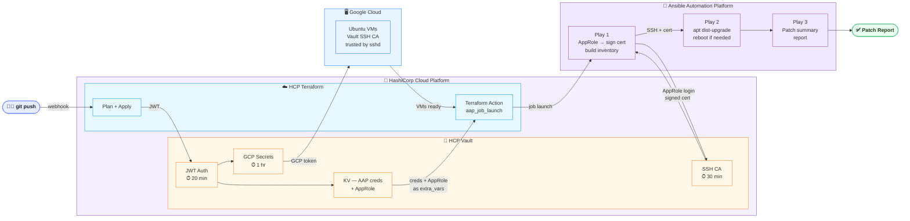

# From IaC to InfraOps: Automating Day-2 Operations with Terraform Actions and AAP

Production-ready automated VM patching with zero static credentials. A git push provisions GCP VMs, configures SSH trust via Vault CA, and automatically triggers Ansible patching — no keys, no secrets in code, no manual steps.

[]()
[]()
[]()

---

## How it works


```mermaid
flowchart LR
    DEV(["👨‍💻 git push"]):::trigger

    subgraph HCP ["🏢 HashiCorp Cloud Platform"]
        direction TB
        subgraph TFC ["☁️ HCP Terraform"]
            PLAN["Plan + Apply"]
            ACTION["Terraform Action\naap_job_launch"]
        end
        subgraph VAULT ["🔐 HCP Vault"]
            V1["JWT Auth\n⏱ 20 min"]
            V2["GCP Secrets\n⏱ 1 hr"]
            V3["KV — AAP creds\n+ AppRole"]
            V4["SSH CA\n⏱ 30 min"]
        end
    end

    subgraph GCP ["🖥️ Google Cloud"]
        VM["Ubuntu VMs\nVault SSH CA\ntrusted by sshd"]
    end

    subgraph AAP ["🤖 Ansible Automation Platform"]
        P1["Play 1\nAppRole → sign cert\nbuild inventory"]
        P2["Play 2\napt dist-upgrade\nreboot if needed"]
        P3["Play 3\nPatch summary\nreport"]
    end

    RESULT(["✅ Patch Report"]):::done

    DEV -->|webhook| PLAN
    PLAN -->|JWT| V1
    V1 --> V2 & V3
    V2 -->|GCP token| GCP
    V3 -->|creds + AppRole\nas extra_vars| ACTION
    GCP -->|VMs ready| ACTION
    ACTION -->|job launch| P1
    P1 -->|AppRole login| V4
    V4 -->|signed cert| P1
    P1 -->|SSH + cert| P2
    P2 --> P3 --> RESULT

    classDef trigger fill:#e8eeff,stroke:#4a6cf7,color:#1a1a2e,font-weight:bold
    classDef done fill:#e8fff0,stroke:#27ae60,color:#1a3a1a,font-weight:bold
    style HCP fill:#f5f0ff,stroke:#6b46c1
    style TFC fill:#e8f8ff,stroke:#0099cc
    style VAULT fill:#fff8e8,stroke:#e67e22
    style GCP fill:#e8f4ff,stroke:#1a73e8
    style AAP fill:#f0e8ff,stroke:#8e44ad
    style PLAN fill:#e8f8ff,stroke:#0099cc
    style ACTION fill:#e8f8ff,stroke:#0099cc
    style V1 fill:#fff8e8,stroke:#e67e22
    style V2 fill:#fff8e8,stroke:#e67e22
    style V3 fill:#fff8e8,stroke:#e67e22
    style V4 fill:#fff8e8,stroke:#e67e22
    style VM fill:#e8f4ff,stroke:#1a73e8
    style P1 fill:#f0e8ff,stroke:#8e44ad
    style P2 fill:#f0e8ff,stroke:#8e44ad
    style P3 fill:#f0e8ff,stroke:#8e44ad
```

Every credential is dynamically generated with a short TTL. Nothing is stored in code or state.

| Credential | Source | TTL |
|---|---|---|
| GCP access token | Vault GCP secrets engine | 1 hour |
| AAP credentials | Vault KV | stored, rotated manually |
| SSH certificate | Vault SSH CA | 30 min |
| Vault token (TFC) | JWT auth | 20 min |

---

## Prerequisites

| Requirement | Notes |
|---|---|
| GCP project with billing | [Create project](https://console.cloud.google.com/projectcreate) |
| HCP Vault Dedicated cluster | [Free trial](https://portal.cloud.hashicorp.com/sign-up) |
| HCP Terraform workspace | [Free tier](https://app.terraform.io/signup) |
| Ansible Automation Platform 2.6+ | [Trial](https://www.redhat.com/en/products/trials#ansible) |
| `gcloud`, `vault`, `task` CLIs | `brew install google-cloud-sdk vault go-task` |

---

## Deployment (~60 min)

### Step 1 — GCP setup (5 min)

```bash
gcloud auth login
gcloud config set project YOUR_PROJECT_ID

gcloud services enable compute.googleapis.com \
  iam.googleapis.com \
  cloudresourcemanager.googleapis.com \
  iamcredentials.googleapis.com
```

### Step 2 — Bootstrap (15 min)

The bootstrap module automates all Vault, GCP, and HCP Terraform configuration.

```bash
git clone https://github.com/dr-rahulgaikwad/tf-actions-aap-gcp.git
cd tf-actions-aap-gcp

export VAULT_ADDR="https://your-vault.vault.hashicorp.cloud:8200"
export VAULT_NAMESPACE="admin"
vault login

export TFE_TOKEN="your-tfc-token"

task bootstrap
```

Edit `bootstrap/terraform.tfvars` when prompted:

```hcl
gcp_project_id     = "your-project-id"
vault_addr         = "https://your-vault.vault.hashicorp.cloud:8200"
aap_hostname       = "https://your-aap-server"
aap_username       = "admin"
aap_password       = "your-aap-password"
tfc_organization   = "your-tfc-org"
tfc_workspace_name = "tf-actions-vault-aap-gcp"
```

Bootstrap creates automatically:
- Vault JWT auth for HCP Terraform (20-min TTL)
- Vault GCP secrets engine with dynamic tokens (1-hour TTL)
- Vault SSH CA for ephemeral certificates (30-min TTL)
- AppRole for AAP authentication (10-hour TTL)
- All HCP Terraform workspace variables

### Step 3 — Set Vault SSH CA in HCP Terraform (2 min)

```bash
task add-ssh-ca
```

Copy the printed key and add it as a Terraform variable in HCP Terraform:

```
HCP Terraform → Workspace → Variables → Terraform Variables → Add
Key:   vault_ssh_ca_public_key
Value: ssh-rsa AAAA... (paste full key)
```

This key is written to each VM's `/etc/ssh/trusted-user-ca-keys.pem` at boot so sshd trusts Vault-signed certificates.

### Step 4 — Configure AAP (20 min)

Run `task setup-aap` for the full interactive guide. Summary:

**4.1 — Custom Credential Type**

AAP UI → Administration → Credential Types → Add → Name: `Vault SSH Certificate`

> AAP has two separate fields. Paste each section separately from `scripts/aap-vault-ssh-credential.json`.

**Input Configuration:**
```yaml
fields:
  - id: vault_addr
    label: Vault Address
    type: string
  - id: vault_namespace
    label: Vault Namespace
    type: string
    default: admin
  - id: role_id
    label: AppRole Role ID
    type: string
    secret: true
  - id: secret_id
    label: AppRole Secret ID
    type: string
    secret: true
  - id: ssh_role
    label: SSH Role Name
    type: string
    default: aap-ssh
  - id: ssh_user
    label: SSH Username
    type: string
required:
  - vault_addr
  - role_id
  - secret_id
  - ssh_user
```

**Injector Configuration:**
```yaml
env:
  VAULT_ADDR: '{{ vault_addr }}'
  VAULT_NAMESPACE: '{{ vault_namespace }}'
  VAULT_ROLE_ID: '{{ role_id }}'
  VAULT_SECRET_ID: '{{ secret_id }}'
  VAULT_SSH_ROLE: '{{ ssh_role }}'
extra_vars:
  ansible_user: '{{ ssh_user }}'
  vault_ssh_user: '{{ ssh_user }}'
```

**4.2 — Create Credential**

AAP UI → Resources → Credentials → Add
- Credential Type: `Vault SSH Certificate`
- Vault Address: your Vault URL
- AppRole creds: `task bootstrap-output`
- SSH Username: `ubuntu`

> SSH Username must be `ubuntu` — this is the principal the Vault SSH cert is signed for.

**4.3 — Create Project**

AAP UI → Resources → Projects → Add
- SCM Type: Git
- SCM URL: `https://github.com/dr-rahulgaikwad/tf-actions-aap-gcp`

**4.4 — Create Job Template**

AAP UI → Resources → Templates → Add Job Template
- Name: `Patch GCP VMs`
- Inventory: `demo-gcp-vms` (auto-created by Terraform)
- Playbook: `ansible/gcp_vm_patching_demo.yml`
- Credentials: `Vault SSH Certificate`
- Variables: enable Prompt on launch
- Note the Template ID from the URL

**4.5 — Set remaining HCP Terraform variables**

| Variable | How to set |
|---|---|
| `vault_ssh_ca_public_key` | Step 3 above |
| `ansible_user` | `ubuntu` |
| `aap_job_template_id` | Template ID from step 4.4 |
| `aap_oidc_issuer_url` | Your AAP server URL |
| `aap_oidc_repository` | `your-org/tf-actions-aap-gcp` |
| `aap_server_ip` | AAP server public IP (production) |
| `aap_insecure_skip_verify` | `true` for demo, `false` for production |

All other variables are auto-set by bootstrap.

### Step 5 — Deploy (10 min)

```bash
git push origin main
```

Monitor the run in HCP Terraform. After apply:
- VMs are created with Vault SSH CA trusted in sshd
- Terraform Actions automatically triggers the AAP patching job
- Patch summary report is printed in AAP job output

### Step 6 — Verify (5 min)

```bash
task test-vault   # Vault connectivity and credentials
task test-vms     # VMs running in GCP
```

Check AAP UI → Resources → Jobs for the patch run and summary report.

---

## Patch Summary Report

Each patching run produces a per-host report and an overall summary in the AAP job output:

```
[ubuntu-vm-1] (34.31.144.26) | Patched: True | Packages: 52 | Reboot required: True
  libssl1.1, systemd, libc6, libpam0g, libgnutls30, ...

[ubuntu-vm-2] (34.31.144.27) | Patched: True | Packages: 48 | Reboot required: False
  libssl1.1, systemd, libc6, ...

========================================
         PATCH SUMMARY REPORT
========================================
Environment  : demo
Patch type   : security
Total VMs    : 2
VMs patched  : 2
VMs unchanged: 0
Reboots needed: 1
Total packages upgraded: 100
========================================
```

---

## Task commands

```bash
task bootstrap        # One-time setup: Vault + GCP + HCP Terraform
task bootstrap-output # Show bootstrap outputs (AppRole creds, SSH CA, next steps)
task add-ssh-ca       # Print Vault SSH CA key to set in HCP Terraform
task setup-aap        # Print AAP setup guide

task validate         # Validate tools, GCP auth, Vault auth, Terraform config
task deploy           # git add/commit/push to trigger a run

task test             # Run all post-deployment tests
task test-vault       # Test Vault GCP token and AAP credential access
task test-vms         # List running GCP VMs

task clean            # Remove local Terraform cache and temp files
```

---

## Security

**Zero static credentials**
- No credentials in code or Terraform state
- No static SSH keys
- No service account keys in AAP
- All credentials dynamically generated with TTL enforcement

**Production hardening**

```hcl
# terraform.tfvars
environment              = "production"
aap_server_ip            = "1.2.3.4"   # Restricts SSH firewall to AAP IP only
aap_insecure_skip_verify = false        # Requires valid TLS cert on AAP
```

Remove `AAP_INSECURE_SKIP_VERIFY` from HCP Terraform environment variables in production.

**Audit trail**
- Vault audit logs: all token generation and SSH certificate signing
- GCP Cloud Audit Logs: all API calls
- AAP job logs: all playbook execution with patch summary

---

## Troubleshooting

**Vault JWT auth fails**
```bash
vault read auth/jwt/role/terraform-cloud
# Check TFC_VAULT_BACKED_JWT_AUTH=true and TFC_VAULT_PROVIDER_AUTH=true in HCP TF workspace
```

**GCP token generation fails**
```bash
vault read gcp/token/terraform-provisioner
gcloud projects get-iam-policy PROJECT_ID  # Check vault-admin SA permissions
```

**SSH connection fails**
```bash
# Verify Vault SSH CA is in sshd config on the VM
gcloud compute ssh VM_NAME --command="cat /etc/ssh/sshd_config | grep TrustedUserCAKeys"

# Test AppRole auth manually
vault write auth/approle/login role_id=ROLE_ID secret_id=SECRET_ID

# Test cert signing
vault write ssh/sign/aap-ssh public_key=@~/.ssh/id_ed25519.pub
```

**Patch summary missing**
- Ensure AAP project is synced after any playbook changes (AAP UI → Projects → sync)
- `set_stats` with `aggregate: yes, per_host: no` is used to accumulate results across hosts — verify AAP execution environment has `ansible.builtin.set_stats` available

---

## Project structure

```
.
├── Taskfile.yml                        # All automation tasks
├── bootstrap/                          # One-time setup (run once per environment)
│   ├── main.tf                         # Vault + GCP + HCP Terraform config
│   ├── variables.tf
│   ├── outputs.tf
│   └── terraform.tfvars.example
├── terraform/                          # Main infrastructure
│   ├── main.tf                         # VMs + Workload Identity
│   ├── providers.tf                    # Dynamic credentials via Vault
│   ├── actions.tf                      # Terraform Actions → AAP trigger
│   ├── variables.tf
│   ├── outputs.tf
│   └── terraform.tfvars.example
├── ansible/
│   └── gcp_vm_patching_demo.yml        # Patching playbook with summary report
└── scripts/
    └── aap-vault-ssh-credential.json   # AAP credential type definition
```

---

## Cost estimate

| Resource | Monthly (us-central1) |
|---|---|
| 2x e2-medium VMs | ~$50 |
| Networking | ~$5 |
| Vault, Workload Identity | Free tier |
| **Total** | **~$55** |

Reduce cost: preemptible VMs (-70%), scheduled shutdown (-50%), committed use (-57%).

---

## Resources

- [Terraform Actions docs](https://developer.hashicorp.com/terraform/cloud-docs/integrations/run-tasks)
- [Vault JWT Auth](https://developer.hashicorp.com/vault/docs/auth/jwt)
- [Vault GCP Secrets](https://developer.hashicorp.com/vault/docs/secrets/gcp)
- [Vault SSH CA](https://developer.hashicorp.com/vault/docs/secrets/ssh/signed-ssh-certificates)
- [GCP Workload Identity Federation](https://cloud.google.com/iam/docs/workload-identity-federation)
- [AAP Provider](https://registry.terraform.io/providers/ansible/aap/latest/docs)

---

## License

MIT — see [LICENSE](./LICENSE)

---

**v3.0.0** · Dr. Rahul Gaikwad · HashiCorp Solutions Architect

