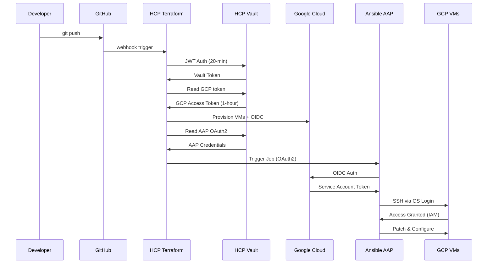

# Terraform Actions + AAP + GCP VM Patching

**Production-ready automated VM patching with zero static credentials.**

[]()
[]()
[]()

---

## SSH Authentication Architecture

This project uses **Vault SSH CA** (not GCP OS Login) for SSH authentication:

- VMs boot with `enable-oslogin=FALSE`
- A startup script writes the Vault CA public key to `/etc/ssh/trusted-user-ca-keys.pem` and configures `sshd` to trust it
- AAP generates an ephemeral keypair per job run, signs it with Vault (30-min TTL), and SSHs using the signed certificate
- No static SSH keys anywhere

> This is the same pattern used by [GlennChia/terraform-actions-ansible-job-vault-ssh-vm-config](https://github.com/GlennChia/terraform-actions-ansible-job-vault-ssh-vm-config) — baking the CA into the image via Packer — but done at boot via GCP startup script instead.

---

## 🚀 Deployment Guide (<60 Minutes)

### Prerequisites

| Requirement | Notes |
|-------------|-------|
| GCP Project with billing enabled | [Create project](https://console.cloud.google.com/projectcreate) |
| HCP Vault Dedicated cluster | [Free trial](https://portal.cloud.hashicorp.com/sign-up) |
| HCP Terraform workspace | [Free tier](https://app.terraform.io/signup) |
| Ansible Automation Platform 2.6+ | [Trial](https://www.redhat.com/en/products/trials#ansible) |
| `gcloud`, `vault`, `terraform`, `task` CLIs | See install commands below |

```bash
# macOS
brew install google-cloud-sdk vault terraform go-task

# Linux
curl https://sdk.cloud.google.com | bash
sudo apt-get install vault terraform  # after adding HashiCorp apt repo
```

---

### Step 1: Authenticate & Enable GCP APIs (5 min)

```bash
gcloud auth login
gcloud config set project YOUR_PROJECT_ID
export GOOGLE_APPLICATION_CREDENTIALS="$HOME/.config/gcloud/application_default_credentials.json"

gcloud services enable compute.googleapis.com \
  iam.googleapis.com \
  cloudresourcemanager.googleapis.com \
  iamcredentials.googleapis.com
```

> The bootstrap module automatically creates the `vault-admin` service account with least-privilege IAM roles and configures Vault's GCP secrets engine. No manual service account setup required.

---

### Step 2: Bootstrap — Automates All Vault + GCP + TFC Setup (15 min)

```bash
git clone https://github.com/dr-rahulgaikwad/tf-actions-aap-gcp.git
cd tf-actions-aap-gcp

export VAULT_ADDR="https://your-vault.vault.hashicorp.cloud:8200"
export VAULT_NAMESPACE="admin"
vault login

export TFE_TOKEN="your-tfc-token"

cd bootstrap
cp terraform.tfvars.example terraform.tfvars
```

Edit `bootstrap/terraform.tfvars`:

```hcl
gcp_project_id     = "your-project-id"
vault_addr         = "https://your-vault.vault.hashicorp.cloud:8200"
aap_hostname       = "https://your-aap-server"
aap_username       = "admin"
aap_password       = "your-aap-password"
tfc_organization   = "your-tfc-org"
tfc_workspace_name = "tf-actions-vault-aap-gcp"
```

```bash
terraform init
terraform apply

# Save AppRole credentials for AAP setup
terraform output -json approle_credentials > /tmp/approle.json
```

**Bootstrap creates automatically:**
- ✅ Vault JWT auth for HCP Terraform (20-min TTL)
- ✅ Vault GCP secrets engine with dynamic tokens (1-hour TTL)
- ✅ Vault SSH CA for ephemeral certificates (30-min TTL)
- ✅ AppRole for AAP authentication (10-hour TTL)
- ✅ All HCP Terraform workspace variables configured

---

### Step 3: Set Vault SSH CA in HCP Terraform (2 min)

```bash
# Still in bootstrap/ directory
terraform output -raw vault_ssh_ca_public_key
```

Copy the output and add it as a Terraform variable in HCP Terraform:

```
HCP Terraform → Workspace → Variables → Terraform Variables → Add
Key:   vault_ssh_ca_public_key
Value: ssh-rsa AAAA... (paste full key)
```

This key is written to each VM's `/etc/ssh/trusted-user-ca-keys.pem` at boot via startup script, so sshd trusts Vault-signed certificates.

```bash
cd ..
```

---

### Step 4: Configure AAP (20 min)

**4.1 — Create Custom Credential Type**

- AAP UI → Administration → Credential Types → Add
- Name: `Vault SSH Certificate`

> ⚠️ AAP has **two separate fields**. Do NOT paste the whole file — paste each section separately.

**Input Configuration** field — paste this:
```yaml
fields:
  - id: vault_addr
    label: Vault Address
    type: string
  - id: vault_namespace
    label: Vault Namespace
    type: string
    default: admin
  - id: role_id
    label: AppRole Role ID
    type: string
    secret: true
  - id: secret_id
    label: AppRole Secret ID
    type: string
    secret: true
  - id: ssh_role
    label: SSH Role Name
    type: string
    default: aap-ssh
  - id: ssh_user
    label: SSH Username
    type: string
required:
  - vault_addr
  - role_id
  - secret_id
  - ssh_user
```

**Injector Configuration** field — paste this:
```yaml
env:
  VAULT_ADDR: '{{ vault_addr }}'
  VAULT_NAMESPACE: '{{ vault_namespace }}'
  VAULT_ROLE_ID: '{{ role_id }}'
  VAULT_SECRET_ID: '{{ secret_id }}'
  VAULT_SSH_ROLE: '{{ ssh_role }}'
extra_vars:
  ansible_user: '{{ ssh_user }}'
  vault_ssh_user: '{{ ssh_user }}'
```

- Save

**4.2 — Create Credential**

- AAP UI → Resources → Credentials → Add
- Name: `Vault SSH`
- Credential Type: `Vault SSH Certificate`
- Vault Address: `https://your-vault.vault.hashicorp.cloud:8200`
- Vault Namespace: `admin`
- AppRole Role ID: (from `cd bootstrap && terraform output -json approle_credentials`)
- AppRole Secret ID: (from `cd bootstrap && terraform output -json approle_credentials`)
- SSH Role Name: `aap-ssh`
- SSH Username: `ubuntu`
- Save

> ⚠️ **SSH Username must be `ubuntu`** — this is the principal the Vault SSH cert is signed for. If it doesn't match the Linux user on the VM, SSH fails with `Permission denied (publickey)`.

**4.3 — Create Project**

- AAP UI → Resources → Projects → Add
- Name: `GCP VM Management`
- SCM Type: `Git`
- SCM URL: `https://github.com/dr-rahulgaikwad/tf-actions-aap-gcp`
- Save & Sync (wait for green status)

**4.4 — Create Job Template**

- AAP UI → Resources → Templates → Add Job Template
- Name: `Patch GCP VMs`
- Inventory: `demo-gcp-vms` ⚠️ *Auto-created by Terraform — leave as-is for now*
- Project: `GCP VM Management`
- Playbook: `ansible/gcp_vm_patching_demo.yml`
- Credentials: `Vault SSH`
- Variables: Enable "Prompt on launch"
- Save
- **Note the Template ID from the URL:** `/templates/job_template/<ID>/`

**4.5 — Set Remaining Variables in HCP Terraform**

**Terraform Variables** (HCP Terraform → Workspace → Variables → Terraform):

| Variable | Value | Set by Bootstrap? |
|----------|-------|:-----------------:|
| `vault_addr` | `https://your-vault.vault.hashicorp.cloud:8200` | ✅ Auto |
| `vault_namespace` | `admin` | ✅ Auto |
| `vault_gcp_roleset` | `terraform-provisioner` | ✅ Default |
| `gcp_project_id` | `your-project-id` | ✅ Auto |
| `gcp_region` | `us-central1` | ✅ Auto |
| `gcp_zone` | `us-central1-a` | ✅ Auto |
| `aap_hostname` | `https://your-aap-server` | ✅ Auto |
| `environment` | `demo` | ✅ Auto — **update to `production`** |
| `vm_count` | `2` | ✅ Auto |
| `vault_ssh_ca_public_key` | (from Step 3) | ⚠️ **Set manually in Step 3** |
| `ansible_user` | `ubuntu` | ⚠️ **Set manually** |
| `aap_job_template_id` | `<ID from step 4.4>` | ⚠️ **Set manually after step 4.4** |
| `aap_oidc_issuer_url` | `https://your-aap-server` | ⚠️ **Set manually** |
| `aap_oidc_repository` | `your-org/tf-actions-aap-gcp` | ⚠️ **Set manually** |
| `aap_server_ip` | Your AAP server's public IP | ⚠️ **Required for production** |

**Environment Variables** (HCP Terraform → Workspace → Variables → Environment):

| Variable | Value | Set by Bootstrap? |
|----------|-------|:-----------------:|
| `TFC_VAULT_PROVIDER_AUTH` | `true` | ✅ Auto |
| `TFC_VAULT_BACKED_JWT_AUTH` | `true` | ✅ Auto |
| `TFC_VAULT_ADDR` | `https://your-vault.vault.hashicorp.cloud:8200` | ✅ Auto |
| `TFC_VAULT_NAMESPACE` | `admin` | ✅ Auto |
| `TFC_VAULT_RUN_ROLE` | `terraform-cloud` | ✅ Auto |

> ⚠️ Do NOT set `AAP_INSECURE_SKIP_VERIFY` in production. Only use it if your AAP has a self-signed cert during testing.

---

### Step 5: Deploy Infrastructure (10 min)

```bash
git add .
git commit -m "Production deployment"
git push origin main
```

Monitor the run in HCP Terraform UI. After `apply` completes:
- VMs are created with Vault SSH CA trusted in sshd
- AAP inventory `demo-gcp-vms` is auto-populated
- Terraform Actions automatically triggers the AAP patching job

---

### Step 6: Verify (5 min)

```bash
# Test Vault connectivity and credentials
task test-vault

# Confirm VMs are running
task test-vms

# Check AAP job completed successfully in AAP UI
# Resources → Jobs → most recent job
```

**Done.** VMs are patched with zero static credentials.

---

## 🔒 Security Architecture

### Zero Static Credentials
✅ No credentials in code  
✅ No credentials in Terraform state  
✅ No static SSH keys  
✅ No service account keys in AAP  
✅ All credentials auto-rotate  
✅ Vault SSH CA with 30-min TTL

### Audit Trail
- Vault audit logs: All token generation and SSH certificate signing
- GCP Cloud Audit Logs: All API calls
- AAP job logs: All playbook execution
- OS Login logs: All SSH sessions

### Production Hardening
```hcl
# Set in Terraform variables
environment = "production"
aap_server_ip = "1.2.3.4"  # Restrict firewall to AAP IP

# Remove in HCP Terraform (enable TLS verification)
AAP_INSECURE_SKIP_VERIFY
```

---

## 🛠️ Troubleshooting

### Vault JWT Auth Fails
```bash
# Check environment variables in HCP Terraform
TFC_VAULT_BACKED_JWT_AUTH=true
TFC_VAULT_PROVIDER_AUTH=true

# Verify JWT role
vault read auth/jwt/role/terraform-cloud
```

### GCP Token Generation Fails
```bash
# Test token generation
vault read gcp/token/terraform-provisioner

# Check service account permissions
gcloud projects get-iam-policy PROJECT_ID
```

### Vault SSH CA Fails
```bash
# Test AppRole authentication
vault write auth/approle/login role_id=<role_id> secret_id=<secret_id>

# Test SSH certificate signing
vault write ssh/sign/aap-ssh public_key=@~/.ssh/id_rsa.pub

# Verify CA is added to GCP
gcloud compute os-login ssh-keys list
```

### SSH Connection Fails
```bash
# Verify OS Login is enabled
gcloud compute instances describe VM_NAME --format="value(metadata.items[enable-oslogin])"

# Check IAM permissions
gcloud compute instances get-iam-policy VM_NAME

# Test SSH manually
gcloud compute ssh VM_NAME --tunnel-through-iap
```

---

## 📊 Cost Estimate

| Resource | Monthly Cost (us-central1) |
|----------|---------------------------|
| 2x e2-medium VMs | ~$50 |
| Networking | ~$5 |
| Workload Identity | Free |
| OS Login | Free |
| **Total** | **~$55** |

**Optimization:**
- Use preemptible VMs: -70% cost
- Schedule shutdown: -50% cost (off-hours)
- Committed use: -57% cost (1-year)

---

## 📁 Project Structure

```
.
├── README.md                          # This file
├── Taskfile.yml                       # Automation tasks
├── bootstrap/                         # One-time setup (Vault + GCP + TFC)
│   ├── main.tf
│   ├── variables.tf
│   ├── outputs.tf
│   └── terraform.tfvars.example
├── terraform/
│   ├── main.tf                        # VM + Workload Identity
│   ├── providers.tf                   # Dynamic credentials
│   ├── actions.tf                     # Terraform Actions + AAP
│   ├── variables.tf
│   ├── outputs.tf
│   └── terraform.tfvars.example
├── ansible/
│   └── gcp_vm_patching_demo.yml       # Patching playbook
└── scripts/
    └── aap-vault-ssh-credential.json  # AAP credential type definition
```

---

## 🎯 Task Commands

```bash
# Quick start
task quick-deploy      # Show quick deployment guide
task bootstrap         # Run complete bootstrap setup
task add-ssh-ca        # Add Vault SSH CA to GCP
task setup-aap         # Show AAP setup guide

# Testing
task test              # Test entire deployment
task test-vault        # Test Vault connectivity
task test-vms          # Check VMs are running

# Bootstrap helpers
task bootstrap-apply   # Apply bootstrap configuration
task bootstrap-output  # Show bootstrap outputs

# Cleanup
task clean             # Clean temporary files
```

---

## 🔄 Architecture Deep Dive

### Dynamic Credential Chain


```mermaid
sequenceDiagram
    participant Dev as Developer
    participant GH as GitHub
    participant TFC as HCP Terraform
    participant Vault as HCP Vault
    participant GCP as Google Cloud
    participant AAP as Ansible AAP
    participant VM as GCP VMs

    Dev->>GH: git push
    GH->>TFC: webhook trigger
    TFC->>Vault: JWT Auth (20-min)
    Vault->>TFC: Vault Token
    TFC->>Vault: Read GCP token
    Vault->>TFC: GCP Access Token (1-hour)
    TFC->>GCP: Provision VMs + OIDC
    TFC->>Vault: Read AAP OAuth2
    Vault->>TFC: AAP Credentials
    TFC->>AAP: Trigger Job (OAuth2)
    AAP->>GCP: OIDC Auth
    GCP->>AAP: Service Account Token
    AAP->>VM: SSH via OS Login
    VM->>AAP: Access Granted (IAM)
    AAP->>VM: Patch & Configure
```

### Key Components

**1. HCP Terraform Cloud**
- Infrastructure orchestration
- JWT authentication to Vault
- Terraform Actions for automation
- Remote state management

**2. HCP Vault**
- Dynamic GCP token generation
- AAP credential storage
- JWT authentication
- Audit logging

**3. Google Cloud Platform**
- VM hosting (Ubuntu 20.04 LTS)
- Workload Identity Federation (OIDC)
- OS Login (IAM-based SSH)
- Cloud Audit Logs

**4. Ansible Automation Platform**
- Configuration management
- VM patching orchestration
- OIDC authentication to GCP
- Job template execution

### Security Model

**Principle: Zero Trust, Zero Static Credentials**

Every credential is:
- ✅ Dynamically generated
- ✅ Short-lived (TTL enforced)
- ✅ Automatically rotated
- ✅ Fully audited
- ✅ Never stored in code or state

**Attack Surface: Minimal**
- No SSH keys to steal
- No service account keys to leak
- No passwords in configuration
- All access is IAM-based
- Complete audit trail

---

## 🚀 Production Deployment

### Pre-Production Checklist

```bash
# 1. Validate everything
task validate

# 2. Review configuration
cat terraform/terraform.tfvars

# 3. Set production environment
environment = "production"
aap_server_ip = "YOUR_AAP_IP"

# 4. Enable security features
# Remove AAP_INSECURE_SKIP_VERIFY
# Enable Vault audit logging
# Enable GCP Cloud Audit Logs

# 5. Deploy
git push origin main
```

### Monitoring Setup

**Terraform Runs:**
- HCP Terraform UI → Notifications
- Slack/Email alerts on failures

**AAP Jobs:**
- AAP → Notifications
- Webhook to monitoring system

**VM Patching:**
- GCP Cloud Monitoring
- Custom dashboards for patch compliance

**Cost Monitoring:**
- GCP Billing alerts
- Budget thresholds

---

## 📚 Additional Resources

### Documentation
- [Terraform Actions](https://developer.hashicorp.com/terraform/cloud-docs/integrations/run-tasks)
- [Vault JWT Auth](https://developer.hashicorp.com/vault/docs/auth/jwt)
- [Vault GCP Secrets](https://developer.hashicorp.com/vault/docs/secrets/gcp)
- [GCP Workload Identity](https://cloud.google.com/iam/docs/workload-identity-federation)
- [GCP OS Login](https://cloud.google.com/compute/docs/oslogin)
- [AAP Provider](https://registry.terraform.io/providers/ansible/aap/latest/docs)

### Support
- GitHub Issues: Report bugs or request features
- HashiCorp Community: [discuss.hashicorp.com](https://discuss.hashicorp.com)
- GCP Support: [cloud.google.com/support](https://cloud.google.com/support)

---

## 🤝 Contributing

1. Fork the repository
2. Create feature branch: `git checkout -b feature/amazing-feature`
3. Commit changes: `git commit -m 'Add amazing feature'`
4. Push to branch: `git push origin feature/amazing-feature`
5. Open Pull Request

---

## 📄 License

MIT License - See [LICENSE](./LICENSE) file

---

## ✨ Author

**Dr. Rahul Gaikwad**  
HashiCorp Solutions Architect

---

## 🏆 Version

**v3.0.0** - Production Ready with Bootstrap Automation (March 2026)

**Status:** ✅ Zero static credentials, <60 min deployment, production-tested

**Key Features:**
- ✅ Automated bootstrap module
- ✅ Vault SSH CA (30-min TTL certificates)
- ✅ Dynamic GCP credentials (Vault secrets engine)
- ✅ AppRole authentication for AAP
- ✅ Terraform Actions automation
- ✅ Terraform-managed AAP inventory
- ✅ Complete audit trail
- ✅ Production-ready security

**New in v3.0.0:**
- 🆕 Bootstrap module for automated setup
- 🆕 Vault SSH CA integration
- 🆕 Consolidated AAP credential type
- 🆕 Streamlined deployment (<60 min)
- 🆕 Removed all static credentials
- 🆕 Simplified task commands

---

**🎉 Ready to deploy? Run `task quick-deploy` to get started!**

---

## ✅ Deployment Checklist

### Pre-Deployment

#### Tools Installation
- [ ] `gcloud` CLI installed and configured
- [ ] `vault` CLI installed
- [ ] `terraform` CLI installed (optional for HCP Terraform)
- [ ] `jq` installed (optional but recommended)

#### Access Verification
- [ ] GCP project created with billing enabled
- [ ] HCP Terraform account created
- [ ] HCP Vault cluster created
- [ ] Ansible Automation Platform instance available
- [ ] GitHub repository created

### 1. GCP Setup

#### Project Configuration
- [ ] GCP project ID noted: `_________________`
- [ ] Billing enabled on project
- [ ] Authenticated to GCP: `gcloud auth login`
- [ ] Project set: `gcloud config set project PROJECT_ID`

#### API Enablement
- [ ] Compute Engine API enabled
- [ ] IAM API enabled
- [ ] Cloud Resource Manager API enabled
- [ ] IAM Credentials API enabled

```bash
gcloud services enable compute.googleapis.com \
  iam.googleapis.com \
  cloudresourcemanager.googleapis.com \
  iamcredentials.googleapis.com
```

### 2. Vault Setup

#### JWT Auth Configuration
- [ ] JWT auth method enabled: `vault auth enable jwt`
- [ ] JWT config written with Terraform Cloud issuer
- [ ] Policy created: `terraform-provisioner`
- [ ] JWT role created: `terraform-cloud` with correct org bound_claims
- [ ] JWT role tested: `vault read auth/jwt/role/terraform-cloud`

#### GCP Secrets Engine
- [ ] GCP secrets engine enabled: `vault secrets enable gcp`
- [ ] GCP config written with service account credentials
- [ ] Roleset created: `terraform-provisioner` with required IAM roles
- [ ] Token generation tested: `vault read gcp/token/terraform-provisioner`
- [ ] Service account key deleted from local system

#### KV Secrets Engine
- [ ] KV v2 enabled at `secret/`
- [ ] AAP credentials stored: `vault kv put secret/aap/credentials hostname=... username=... password=...`
- [ ] Credentials tested: `vault kv get secret/aap/credentials`

### 3. AAP Setup

#### OAuth2 Application
- [ ] Application created: `Terraform Automation`
- [ ] Grant type: Resource owner password-based, Client type: Confidential
- [ ] Client ID and Secret noted and stored in Vault

#### Project & Job Template
- [ ] Ansible project created and synced with Git repository
- [ ] Playbook `gcp_vm_patching_demo.yml` available
- [ ] Job template created: `Patch GCP VMs`
- [ ] Inventory: `demo-gcp-vms` (auto-created by Terraform)
- [ ] Credentials: `Vault SSH` attached
- [ ] Job template ID noted and set in Terraform variable `aap_job_template_id`
- [ ] Job template launched manually and completed successfully

### 4. HCP Terraform Setup

#### Workspace
- [ ] Workspace created: `tf-actions-vault-aap-gcp`
- [ ] VCS connection configured (GitHub), working directory: `terraform`

#### Environment Variables
- [ ] `TFC_VAULT_BACKED_JWT_AUTH=true`
- [ ] `TFC_VAULT_PROVIDER_AUTH=true`
- [ ] `TFC_VAULT_ADDR=https://vault.hashicorp.cloud:8200`
- [ ] `TFC_VAULT_NAMESPACE=admin`
- [ ] `AAP_INSECURE_SKIP_VERIFY=true` (demo only — remove for production)

#### Terraform Variables
- [ ] `vault_addr`, `vault_namespace`, `vault_gcp_roleset`
- [ ] `gcp_project_id`, `gcp_region`, `gcp_zone`
- [ ] `aap_hostname`, `aap_oidc_issuer_url`, `aap_oidc_repository`, `aap_job_template_id`
- [ ] `vault_ssh_ca_public_key` (from Step 3), `ansible_user` (`ubuntu`), `environment`, `vm_count`, `aap_server_ip`

### 5. Deployment Verification

- [ ] Terraform run completed, VMs created, AAP inventory populated
- [ ] Terraform Actions triggered AAP job automatically
- [ ] VMs patched successfully, logs reviewed

### 6. Production Hardening

- [ ] `environment` set to `production`, `aap_server_ip` configured
- [ ] `AAP_INSECURE_SKIP_VERIFY` removed (TLS verification enabled)
- [ ] Vault audit logging enabled
- [ ] GCP Cloud Audit Logs enabled
- [ ] Monitoring and alerting configured (Terraform, AAP, cost alerts)

---

## 🔄 Rollback Procedures

### Terraform Changes

```bash
# Option 1: Revert Git commit
git revert HEAD && git push origin main

# Option 2: Rollback in HCP Terraform UI
# Workspaces → Runs → Select previous successful run → Rollback
```

### Emergency: Stop All Patching

```bash
# Disable job template in AAP
# Templates → Patch GCP VMs → Edit → Enabled: No
```

### Restore VM from Snapshot

```bash
gcloud compute disks snapshot DISK_NAME --snapshot-names=SNAPSHOT_NAME
gcloud compute disks create NEW_DISK --source-snapshot=SNAPSHOT_NAME
gcloud compute instances attach-disk VM_NAME --disk=NEW_DISK
```

---

## ✔️ Success Criteria

| Area | Criteria |
|------|----------|
| Deployment | All VMs running, OS Login enabled, AAP inventory populated, Terraform Actions triggering |
| Security | Zero static credentials, all credentials dynamic, audit logging enabled, least-privilege IAM |
| Operations | GitOps workflow functioning, monitoring active, documentation complete |

