# From IaC to InfraOps: Automating Day-2 Operations with Terraform Actions and AAP

Production-ready automated VM patching with zero static credentials. A git push provisions GCP VMs, configures SSH trust via Vault CA, and automatically triggers Ansible patching — no keys, no secrets in code, no manual steps.

[]()
[]()
[]()

---

## How it works

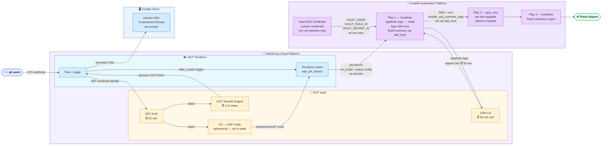
```mermaid
flowchart LR
    DEV(["👨‍💻 git push"]):::trigger

    subgraph HCP ["🏢 HashiCorp Cloud Platform"]
        direction TB
        subgraph TFC ["☁️ HCP Terraform"]
            PLAN["Plan + Apply"]
            ACTION["Terraform Action\naap_job_launch"]
        end
        subgraph VAULT ["🔐 HCP Vault"]
            V1["JWT Auth\n⏱ 20 min"]
            V2["GCP Secrets Engine\n⏱ 1 hr token"]
            V3["KV — AAP creds\nephemeral — not in state"]
            V4["SSH CA\n⏱ 30 min cert"]
        end
    end

    subgraph GCP ["🖥️ Google Cloud"]
        VM["Ubuntu VMs\nTrustedUserCAKeys\nset at boot"]
    end

    subgraph AAP ["🤖 Ansible Automation Platform"]
        CRED["Vault SSH Certificate\ncustom credential\nenv var injection only"]
        P1["Play 1 — localhost\nAppRole login → Vault\nSign SSH cert\nBuild inventory via add_host"]
        P2["Play 2 — gcp_vms\napt dist-upgrade\nreboot if needed"]
        P3["Play 3 — localhost\nPatch summary report"]
    end

    RESULT(["✅ Patch Report"]):::done

    DEV -->|VCS webhook| PLAN
    PLAN -->|JWT workload identity| V1
    V1 -->|token| V2
    V1 -->|token| V3
    V2 -->|dynamic GCP token| PLAN
    V3 -->|ephemeral AAP creds| ACTION
    PLAN -->|provision VMs| VM
    PLAN -->|after_create trigger| ACTION
    ACTION -->|job launch\nvm_hosts + patch config\nno secrets| P1
    CRED -->|VAULT_ADDR\nVAULT_ROLE_ID\nVAULT_SECRET_ID\nas env vars| P1
    P1 -->|AppRole login| V4
    V4 -->|signed cert ⏱ 30 min| P1
    P1 -->|SSH + cert\nansible_ssh_common_args\nset via add_host| P2
    P2 --> P3 --> RESULT

    classDef trigger fill:#e8eeff,stroke:#4a6cf7,color:#1a1a2e,font-weight:bold
    classDef done fill:#e8fff0,stroke:#27ae60,color:#1a3a1a,font-weight:bold
    style HCP fill:#f5f0ff,stroke:#6b46c1
    style TFC fill:#e8f8ff,stroke:#0099cc
    style VAULT fill:#fff8e8,stroke:#e67e22
    style GCP fill:#e8f4ff,stroke:#1a73e8
    style AAP fill:#f0e8ff,stroke:#8e44ad
    style PLAN fill:#d4edff,stroke:#0099cc
    style ACTION fill:#d4edff,stroke:#0099cc
    style V1 fill:#fff3d4,stroke:#e67e22
    style V2 fill:#fff3d4,stroke:#e67e22
    style V3 fill:#fff3d4,stroke:#e67e22
    style V4 fill:#fff3d4,stroke:#e67e22
    style VM fill:#d4eaff,stroke:#1a73e8
    style CRED fill:#ead4ff,stroke:#8e44ad
    style P1 fill:#ead4ff,stroke:#8e44ad
    style P2 fill:#ead4ff,stroke:#8e44ad
    style P3 fill:#ead4ff,stroke:#8e44ad
```

Every credential is dynamically generated with a short TTL. Nothing is stored in code or Terraform state.

| Credential | Source | TTL | In State? |
|---|---|---|---|
| GCP access token | Vault GCP secrets engine | 1 hour | Yes (no ephemeral resource available) |
| AAP credentials | Vault KV — ephemeral resource | session only | No |
| SSH certificate | Vault SSH CA | 30 min | No |
| Vault token (TFC) | JWT auth | 20 min | No |
| AppRole role_id / secret_id | AAP custom credential (env vars) | 10 hours | No |

---

## Architecture Overview

This solution demonstrates **mutable infrastructure** with in-place patching. For immutable infrastructure requirements where VMs are replaced rather than patched, please refer to [this blog post by Glenn Chia Jin Wee](https://medium.com/@glennchia7/terraform-actions-with-ansible-automation-platform-and-vault-ssh-for-vm-configuration-f7514a7c23af).

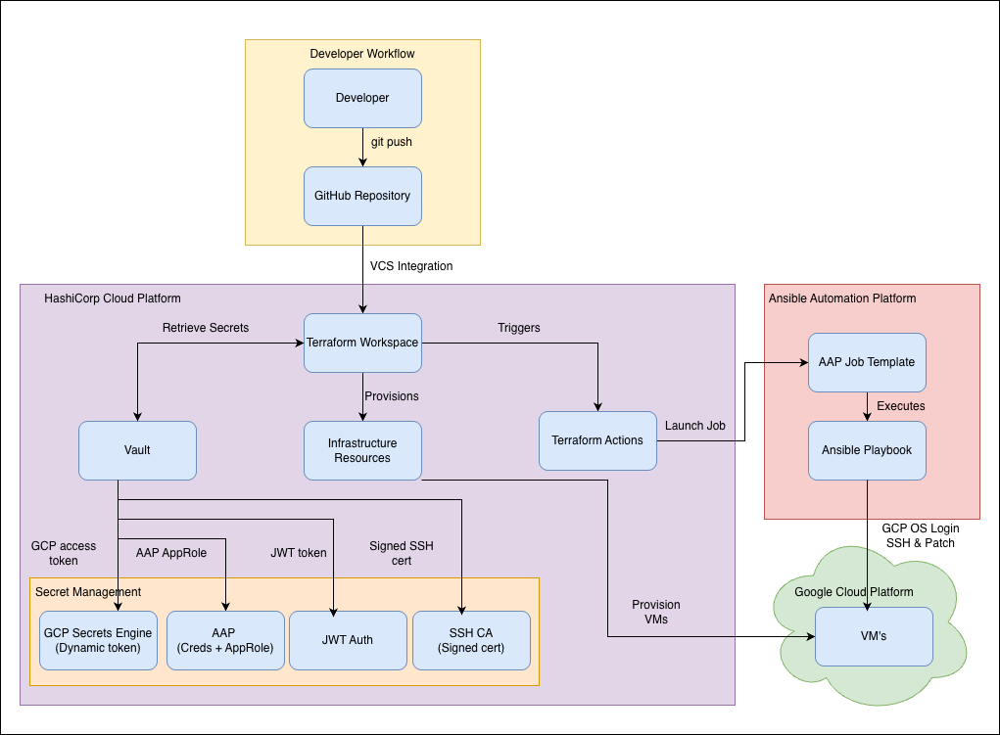

**Workflow:**

1. You commit infrastructure changes to your repository
2. HCP Terraform provisions or updates GCP VMs
3. After a successful `apply`, Terraform Actions automatically trigger an AAP job template
4. AAP retrieves dynamic credentials from Vault
5. Ansible executes patching playbooks against the VM inventory
6. Results flow back to Terraform run logs, completing the audit trail

This architecture is event-driven and automated, with no manual coordination, credential hunting, or context switching.

**Demo Recording:** [From IaC to InfraOps: Automating Day-2 Operations with Terraform Actions & Ansible - DevConf.IN 2026](https://www.youtube.com/watch?v=_AUUM2GAk9g)

---

## Security design

**Secrets never in `extra_vars`**

The AAP provider's `extra_vars` field is not write-only and cannot accept ephemeral values — anything passed there is persisted in AAP job state and Terraform state. All Vault AppRole credentials (`VAULT_ROLE_ID`, `VAULT_SECRET_ID`) are injected exclusively as environment variables via the AAP custom credential type, which encrypts them at rest and never exposes them in job arguments or logs.

**`extra_vars` contains only non-sensitive operational data:**
- `vm_hosts` — VM name → IP map (built at apply time)
- `patch_type`, `reboot_allowed`, `environment`, `gcp_project_id`, `gcp_zone`

**SSH connection args set at host level**

`ansible_ssh_private_key_file` and `ansible_ssh_common_args` (including `-o CertificateFile=`) are set via `add_host` in Play 1, not in play `vars`. This prevents the AAP credential injector's `extra_vars` (which has highest Ansible precedence) from overriding the certificate file argument.

---

## Prerequisites

Before diving into the implementation, set up the foundational infrastructure. This section walks you through creating the necessary accounts and resources from scratch.

### Required Accounts and Services

| Requirement | Setup Guide | Notes |
|---|---|---|
| **GCP project with billing** | [Create project](https://console.cloud.google.com/projectcreate) | Enable required APIs |
| **HCP Vault Dedicated cluster** | [Setup guide](https://developer.hashicorp.com/vault/tutorials/get-started-hcp-vault-dedicated/create-cluster) | Free trial available |
| **HCP Terraform workspace** | [Free tier](https://app.terraform.io/signup) | Configure VCS integration |
| **Ansible Automation Platform 2.6+** | [Install AAP](https://docs.redhat.com/en/documentation/red_hat_ansible_automation_platform/2.6/html/containerized_installation/aap-containerized-installation) or [Trial](https://www.redhat.com/en/products/trials#ansible) | Containerized or VM-based |
| **CLI tools** | `brew install google-cloud-sdk vault go-task` | gcloud, vault, task |

### Code Repository

Fork the GitHub repository to follow along:

```bash
git clone https://github.com/dr-rahulgaikwad/tf-actions-aap-gcp.git
cd tf-actions-aap-gcp
```

---

## Implementation Steps

### Step 1: Configure HCP Vault Dedicated Cluster

Provision or use an existing HCP Vault Dedicated cluster.

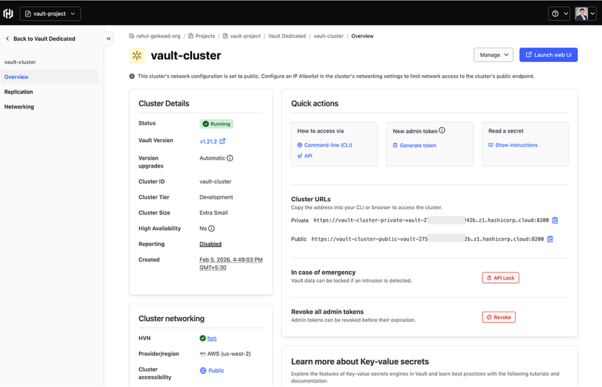

**Configure Vault CLI:**

```bash
export VAULT_ADDR="https://your-vault-cluster-url:8200"
export VAULT_NAMESPACE="admin"
export VAULT_TOKEN="your-admin-token"
```

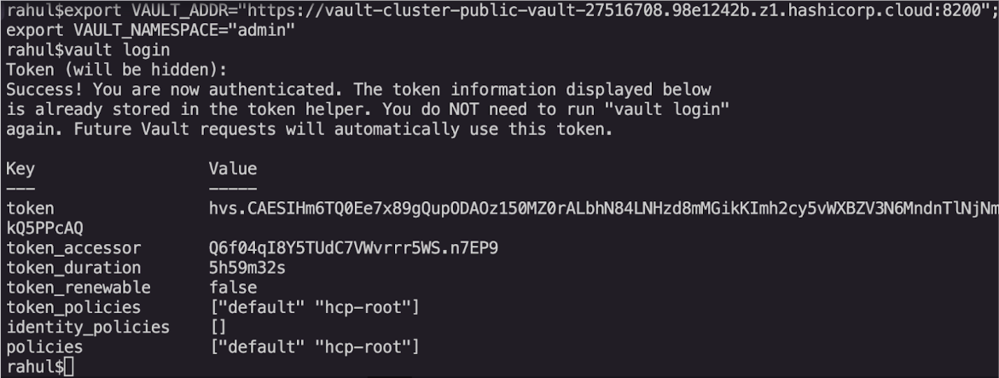

Terraform retrieves GCP credentials at runtime via a Vault data source and AAP credentials via a Vault ephemeral resource ([providers.tf#L49-L73](https://github.com/dr-rahulgaikwad/tf-actions-aap-gcp/blob/main/terraform/providers.tf#L49-L73)). Ephemeral values are never written to state or plan files, keeping secrets out of version control.

---

### Step 2: Create HCP Terraform Workspace

Configure your workspace with VCS integration pointing to your forked repository:

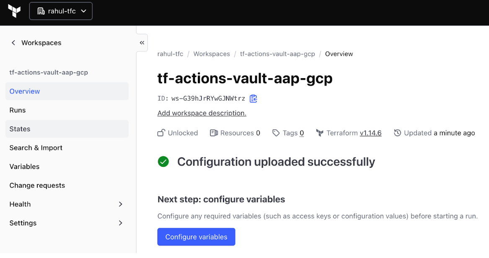

**Configure HCP Terraform environment variables:**

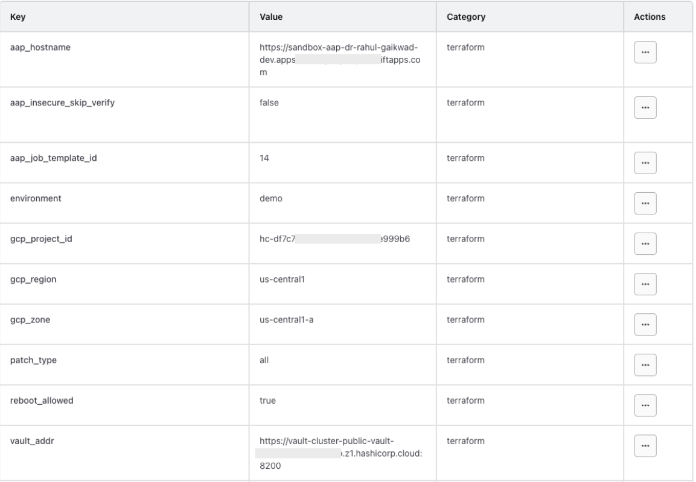

You'll add these variables after bootstrap completes.

---

### Step 3: Configure GCP

Enable required Google Cloud APIs and authenticate:

```bash
# Authenticate with GCP
gcloud auth login

# Set project
gcloud config set project YOUR-PROJECT-ID

export GOOGLE_APPLICATION_CREDENTIALS="$HOME/.config/gcloud/application_default_credentials.json"

# Enable required APIs
gcloud services enable compute.googleapis.com \
  iam.googleapis.com \
  cloudresourcemanager.googleapis.com \
  oslogin.googleapis.com \
  iamcredentials.googleapis.com
```

> **Note:** The [bootstrap module](https://github.com/dr-rahulgaikwad/tf-actions-aap-gcp/blob/main/bootstrap/main.tf#L72) automatically creates the `vault-admin` service account with the required IAM roles and configures Vault's GCP secrets engine. No manual service account setup required.

Learn more about GCP service accounts in the [GCP documentation](https://cloud.google.com/iam/docs/service-accounts-create).

---

### Step 4: Bootstrap Infrastructure

The bootstrap module automates all Vault, GCP, and HCP Terraform configuration.

**Bootstrap creates:**
- GCP service account with IAM roles
- Vault SSH CA for ephemeral certificates
- Vault AppRole for AAP authentication
- AAP credentials stored in Vault
- GCP credentials stored in Vault
- HCP Terraform workspace variables configured

```bash
git clone https://github.com/dr-rahulgaikwad/tf-actions-aap-gcp.git
cd tf-actions-aap-gcp

# Authenticate to Vault
export VAULT_ADDR="https://your-vault.vault.hashicorp.cloud:8200"
export VAULT_NAMESPACE="admin"
vault login

# Authenticate to HCP Terraform
export TFE_TOKEN="your-tfc-token"

# Configure bootstrap
cd bootstrap
cp terraform.tfvars.example terraform.tfvars
```

**Edit `terraform.tfvars`** with your details:

```hcl
# GCP configuration
gcp_project_id = "your-project-id"
gcp_region     = "us-central1"

# Vault configuration
vault_addr      = "https://your-vault.vault.hashicorp.cloud:8200"
vault_namespace = "admin"

# AAP configuration
aap_hostname = "https://your-aap-server"
aap_username = "admin"
aap_password = "your-password"

# HCP Terraform configuration
tfc_organization   = "your-org"
tfc_workspace_name = "tf-actions-vault-aap-gcp"

# Infrastructure configuration
aap_job_template_id = 0  # Update after creating AAP job template
environment         = "demo"
vm_count            = 2
```

> **Important:** `bootstrap/terraform.tfvars` is gitignored. Never commit it.

**Run bootstrap:**

```bash
terraform init
terraform apply
```

**Set `vault_ssh_ca_public_key` in HCP Terraform workspace:**

```bash
terraform output -raw vault_ssh_ca_public_key
```

Paste the value into:
```
HCP Terraform → Workspace → Variables → vault_ssh_ca_public_key
```

**The bootstrap process automatically creates:**
- Vault JWT auth for HCP Terraform (20-min TTL)
- Vault GCP secrets engine with dynamic tokens (1-hour TTL)
- Vault SSH CA for ephemeral certificates (30-min TTL)
- AppRole for AAP authentication (10-hour TTL)
- All HCP Terraform workspace variables configured

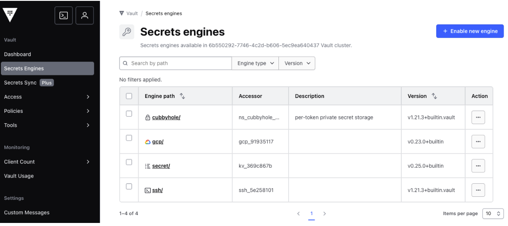

---

### Step 5: Ansible Playbook Overview

The playbook ([gcp_vm_patching_demo.yml](https://github.com/dr-rahulgaikwad/tf-actions-aap-gcp/blob/main/ansible/gcp_vm_patching_demo.yml)) handles patching with error handling:

**Key features:**
- Dynamic inventory from Terraform `vm_inventory` variable
- Connection retry logic (3 attempts with delays)
- Pre-patch status reporting (shows available updates)
- Detailed upgrade output (lists upgraded packages)
- Post-patch verification (confirms patch status)
- Automatic reboot handling (checks `/var/run/reboot-required`)

The playbook is verbose by design — when troubleshooting, you need detailed logs showing exactly what was patched.

---

### Step 6: Configure Ansible Automation Platform

#### 6.1 Create Project

AAP UI → Resources → Projects → Add

- **Name:** GCP VM Management
- **SCM Type:** Git
- **SCM URL:** `https://github.com/<your-org>/tf-actions-aap-gcp`
- **Enable options:** Update revision on job launch

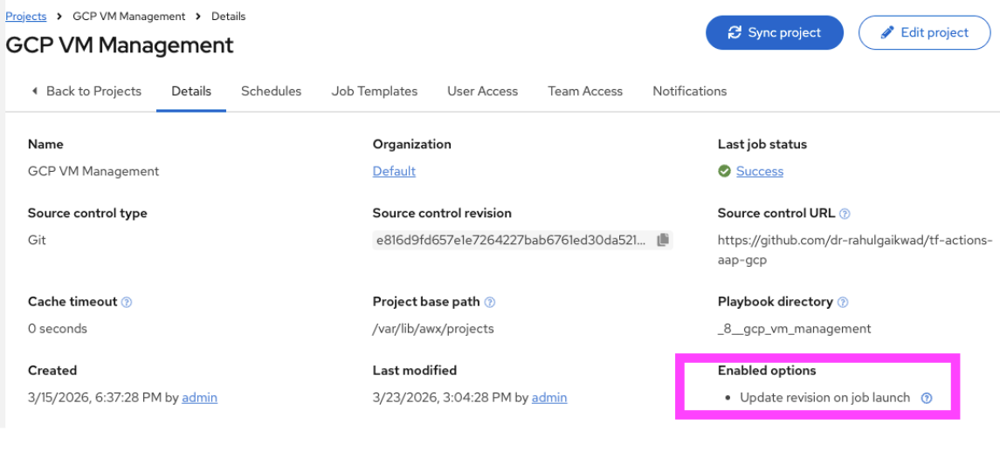

---

#### 6.2 Create Custom Credential Type

AAP UI → Administration → Credential Types → Add

- **Name:** Vault SSH Certificate

> **Note:** AAP has two separate fields. Paste each section separately from `scripts/aap-vault-ssh-credential.json`.

**Input Configuration:**

```yaml
fields:
  - id: vault_addr
    type: string
    label: Vault Address
  - id: vault_namespace
    type: string
    label: Vault Namespace
    default: admin
  - id: role_id
    type: string
    label: AppRole Role ID
    secret: true
  - id: secret_id
    type: string
    label: AppRole Secret ID
    secret: true
  - id: ssh_role
    type: string
    label: SSH Role Name
    default: aap-ssh
  - id: ssh_user
    type: string
    label: SSH Username
required:
  - vault_addr
  - role_id
  - secret_id
  - ssh_user
```

**Injector Configuration:**

```yaml
env:
  VAULT_ADDR: '{{ vault_addr }}'
  VAULT_ROLE_ID: '{{ role_id }}'
  VAULT_SSH_ROLE: '{{ ssh_role }}'
  VAULT_NAMESPACE: '{{ vault_namespace }}'
  VAULT_SECRET_ID: '{{ secret_id }}'
extra_vars:
  ansible_user: '{{ ssh_user }}'
  vault_ssh_user: '{{ ssh_user }}'
```

> **Important:** Secrets are injected as env vars only. `extra_vars` carries only the non-sensitive SSH username.

---

#### 6.3 Create Credential

AAP UI → Resources → Credentials → Add

- **Name:** Vault SSH
- **Credential Type:** Vault SSH Certificate
- **Vault Address:** Your Vault URL
- **AppRole Role ID and Secret ID:** From bootstrap output (`task bootstrap-output`)
- **SSH Role Name:** aap-ssh
- **SSH Username:** ubuntu

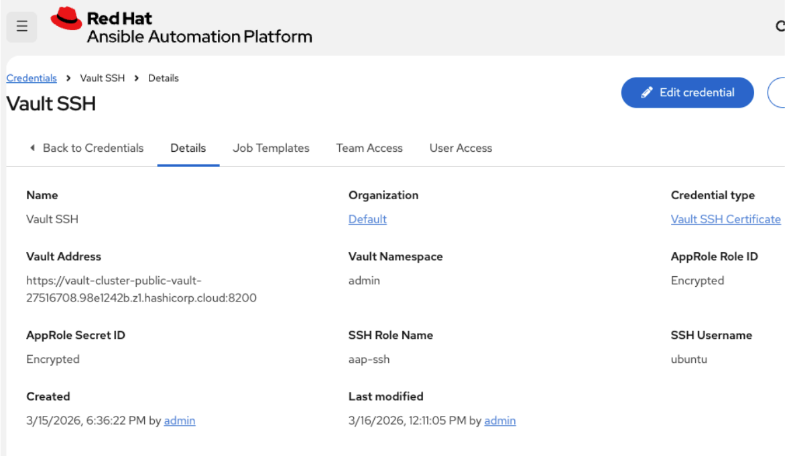

---

#### 6.4 Create Job Template

AAP UI → Resources → Templates → Add Job Template

- **Name:** Patch GCP VMs
- **Inventory:** demo-gcp-vms (auto-created by Terraform)
- **Project:** GCP VM Management
- **Playbook:** ansible/gcp_vm_patching_demo.yml
- **Enable "Prompt on launch" for Variables**
- **Credentials:** Vault SSH Certificate
- **Note the Job Template ID**

**To find the Job Template ID:**
1. Log in to AAP (Automation Controller UI)
2. Go to Resources → Templates
3. Click on the required Job Template
4. Check the URL in the browser: `/templates/job_template/42/details/`
5. The ID is `42` in this example

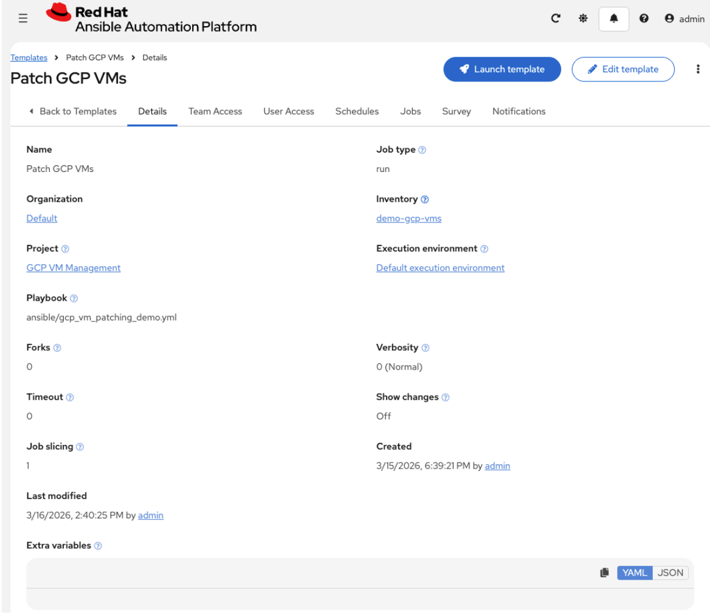

> **Do not pre-populate Extra Variables** on the Job Template with vault credentials. Terraform sends only non-sensitive vars at runtime.

---

#### 6.5 Update HCP Terraform Variables

Set `aap_job_template_id` in HCP Terraform:

```
Workspace → Variables → aap_job_template_id → Update with ID from step 6.4
```

---

### Step 7: Configure Dynamic Provider Credentials

To configure dynamic credentials in HCP Terraform from Vault, add environment variables in the HCP Terraform workspace.

**Go to workspace → variables**

**Add the following environment variables:**

```bash
TFC_VAULT_PROVIDER_AUTH = true
TFC_VAULT_ADDR = https://your-vault.vault.hashicorp.cloud:8200
TFC_VAULT_NAMESPACE = admin
TFC_VAULT_RUN_ROLE = terraform-cloud
TFC_VAULT_BACKED_JWT_AUTH = true
```

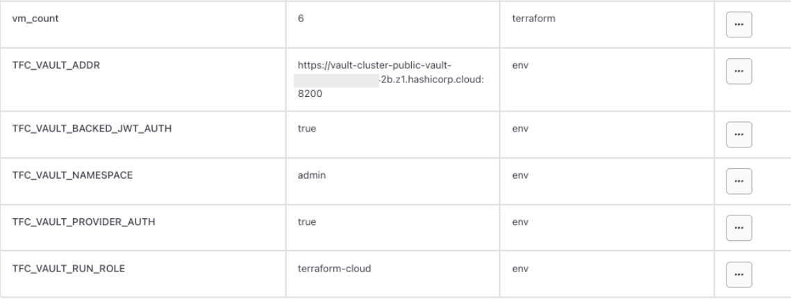

---

### Step 8: Provision Infrastructure with Terraform

First deployment creates VMs and runs initial configuration.

> **Note:** Unlike the local `terraform apply` used during the initial setup, we use a [VCS-driven workflow](https://developer.hashicorp.com/terraform/cloud-docs/workspaces/run/ui#automatically-starting-runs) because the HCP Terraform workspace was configured with Git integration (see step 2). This ensures every change is triggered via an auditable commit and push.

```bash
git push origin main
```

**The code provisions:**
1. VPC network
2. Firewall rules
3. VM instances
4. AAP job triggered automatically (if template ID configured)
5. VMs configured with base packages and security updates
6. Ephemeral SSH credentials auto-deleted

---

### Step 9: Configure Terraform Actions

This solution uses Terraform Actions (introduced in Terraform 1.14) to trigger AAP jobs declaratively. Unlike traditional provisioners or external scripts, Terraform Actions provide:

- **Declarative syntax:** Actions are defined in HCL, not shell scripts
- **Lifecycle integration:** Bind actions to resource events (after_create, after_update)
- **Provider-native:** Actions are implemented by providers (e.g., aap_job_launch)
- **State tracking:** Terraform tracks action execution in state
- **Idempotency:** Actions are properly tracked and won't re-run unnecessarily
- **Error handling:** Failed actions cause Terraform to fail, ensuring consistency

**Actions configuration** ([actions.tf](https://github.com/dr-rahulgaikwad/tf-actions-aap-gcp/blob/main/terraform/actions.tf#L56-L82)) defines the automation:

```hcl
# Define the action (what to do)
action "aap_job_launch" "patch_vms" {
  config {
    job_template_id = var.aap_job_template_id
    wait_for_completion                 = true
    wait_for_completion_timeout_seconds = 1800
    extra_vars      = jsonencode({ ... })
  }
}

# Define the trigger (when to do it)
resource "terraform_data" "trigger_patch" {
  count = var.aap_job_template_id > 0 ? 1 : 0

  input = {
    vm_ids      = [for vm in google_compute_instance.ubuntu_vms : vm.id]
    environment = var.environment
  }

  lifecycle {
    action_trigger {
      events  = [after_create, after_update]
      actions = [action.aap_job_launch.patch_vms]
    }
  }

  depends_on = [time_sleep.wait_for_vms]
}
```

**How it works:**
1. `terraform_data` tracks VM IP addresses in its input attribute
2. When VMs change (create/update/replace), input changes
3. Terraform detects the change and triggers `action_trigger`
4. `aap_job_launch` action executes with current `extra_vars`
5. Terraform waits for AAP job completion (30min timeout)
6. Action result is tracked in Terraform state

---

### Step 10: Testing the Automation

Test the end-to-end automation:

```bash
# Make infrastructure change
git clone https://github.com/your-username/tf-actions-aap-gcp.git
cd tf-actions-aap-gcp
git commit -m "updates"
git push origin main
```

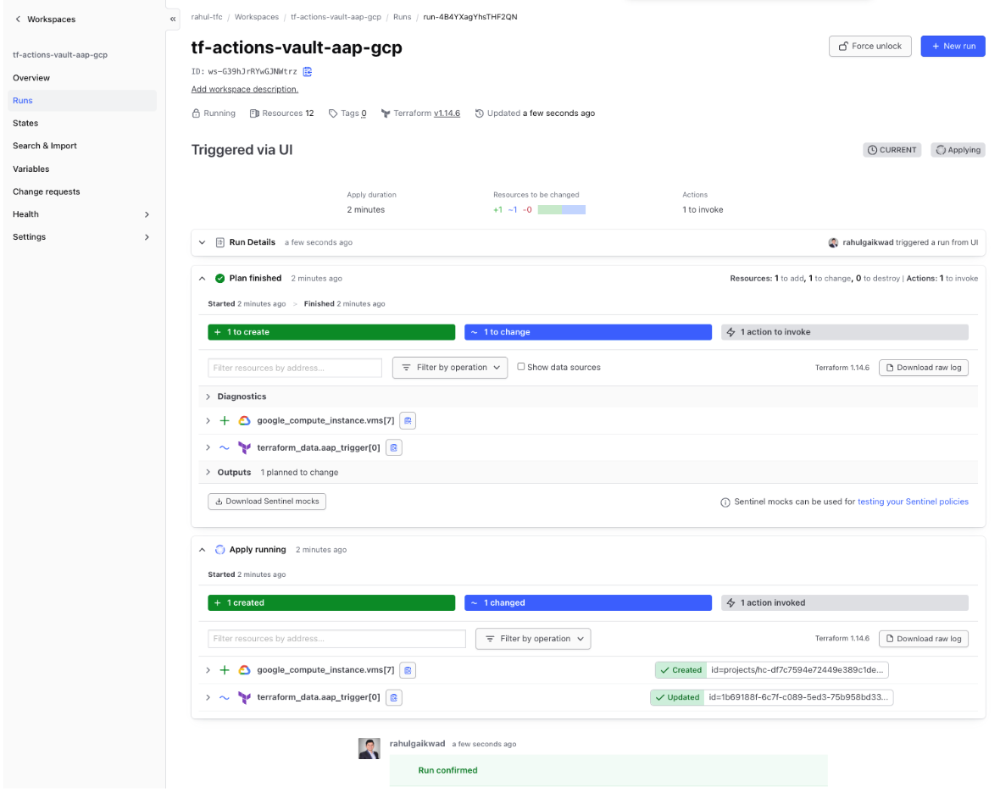

**Monitor the workflow:**
1. **HCP Terraform:** Watch run progress (Plan → Apply)
2. **Terraform Actions:** See action trigger after apply
3. **AAP:** View job execution and detailed patching output
4. **Verify:** SSH into VMs to confirm patches applied

**Expected results:**
- 5 GCP VMs provisioned
- Actions automatically triggered the AAP job
- All VMs patched and rebooted if needed
- Complete logs in HCP Terraform and AAP

---

### Step 11: Viewing the Patch Summary Report

Each patching run produces a per-host report and an overall summary in the AAP job output. The playbook accumulates results across all hosts, then prints them.

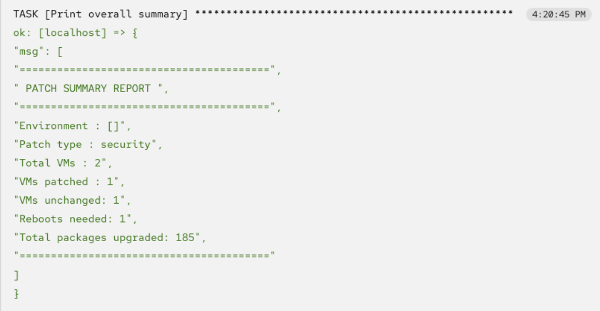

**Example output:**

```
[ubuntu-vm-1] (34.31.144.26) | Patched: True | Packages: 52 | Reboot required: True
[ubuntu-vm-2] (34.31.144.27) | Patched: True | Packages: 48 | Reboot required: False

========================================
         PATCH SUMMARY REPORT
========================================
Environment  : demo
Patch type   : security
Total VMs    : 2
VMs patched  : 2
VMs unchanged: 0
Reboots needed: 1
Total packages upgraded: 100
========================================
```

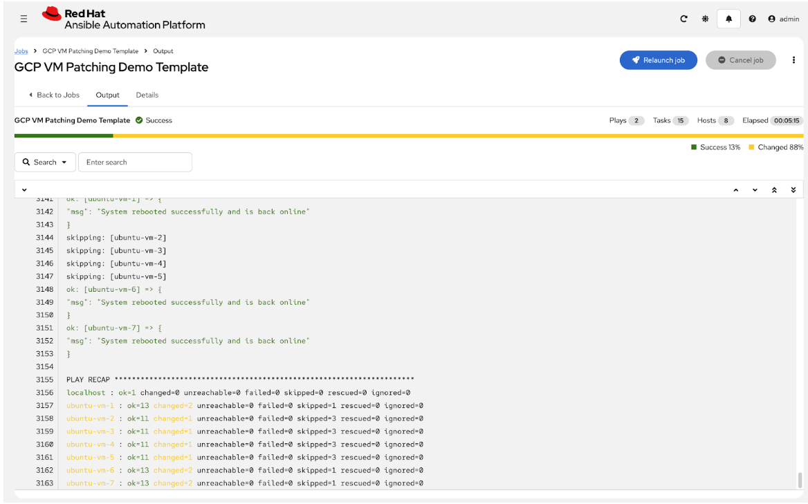

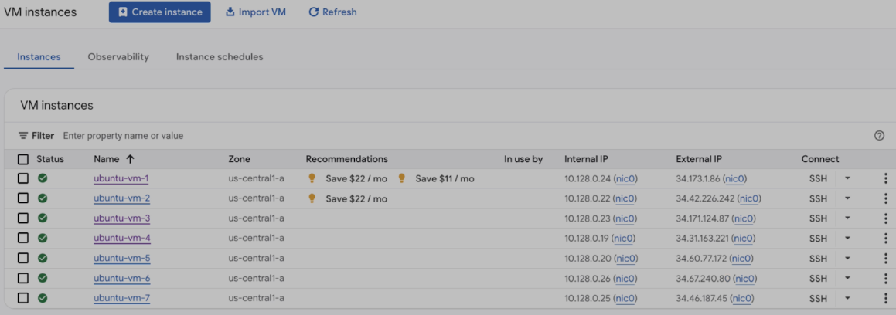

---

## Production Considerations

**Enable best practices:**
- Enable **Prompt on launch** in AAP job template (else `extra_vars` ignored)
- Manual AAP project Sync after playbook changes
- Keep the `time_sleep` resource for VM boot time
- Restrict firewall to AAP IPs (avoid 0.0.0.0/0)
- Use private VMs + NAT + bastion/IAP for SSH
- Monitor execution times and tune timeouts
- Implement Vault credential rotation
- Test failure scenarios (boot, patching, Vault outages)

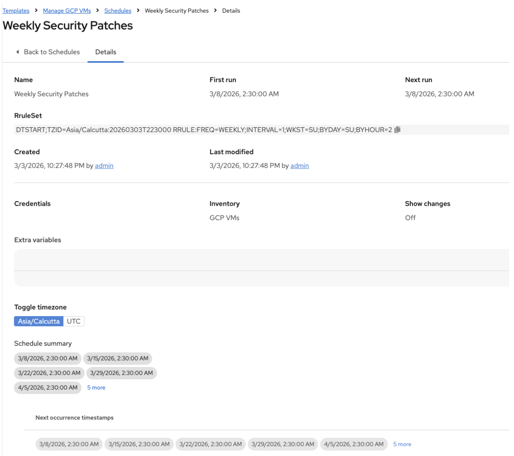

**Production hardening:**

```hcl
# terraform.tfvars (set in HCP Terraform workspace)
environment              = "production"
aap_server_ip            = "1.2.3.4"   # Restricts SSH firewall to AAP IP only
aap_insecure_skip_verify = false        # Requires valid TLS cert on AAP
```

**Verify state is clean after every apply:**

```bash
task check-state
```

**Audit trail:**
- Vault audit logs: all token generation and SSH certificate signing
- GCP Cloud Audit Logs: all API calls
- AAP job logs: all playbook execution with patch summary

---

## Beyond Patching: Other Use Cases

Terraform Actions are the mechanism for Day-2 automation, shifting infrastructure provisioning into a complete, continuous InfraOps workflow. Actions move beyond simple patching to embed critical operational tasks directly into your infrastructure lifecycle:

- **Security & Compliance:** Enforce policy by running **compliance scanning** (CIS benchmarks) and ensuring seamless **certificate deployment** from Vault.
- **Operational Readiness:** Guarantee reliability and quality with automated **backup verification** after provisioning and mandatory **performance testing** before routing traffic.
- **Observability & Governance:** Embed essential management functions like automated **monitoring setup** and **cost optimization** analysis directly into every deployment.

---

## Task Commands

```bash
task bootstrap        # One-time setup: Vault + GCP + HCP Terraform
task bootstrap-output # Show bootstrap outputs (AppRole creds, SSH CA, next steps)
task add-ssh-ca       # Print Vault SSH CA key to set in HCP Terraform
task setup-aap        # Print AAP setup guide

task validate         # Validate tools, GCP auth, Vault auth, Terraform config
task deploy           # git add/commit/push to trigger a run

task test             # Run all post-deployment tests
task test-vault       # Test Vault GCP token and AAP credential path
task test-vms         # List running GCP VMs
task check-state      # Verify no secrets in Terraform state

task clean            # Remove local Terraform cache and temp files
```

---

## Troubleshooting

**Vault JWT auth fails**

```bash
vault read auth/jwt/role/terraform-cloud
# Verify TFC_VAULT_BACKED_JWT_AUTH=true and TFC_VAULT_PROVIDER_AUTH=true in HCP TF workspace
```

**GCP token generation fails**

```bash
vault read gcp/token/terraform-provisioner
gcloud projects get-iam-policy PROJECT_ID  # Check vault-admin SA permissions
```

**AAP job fails with `vault_addr is undefined`**

The Job Template has stale vault variables in its Extra Variables field from a previous run. Clear them:
- AAP UI → Job Templates → your template → Edit → Extra Variables → remove any `vault_addr`, `vault_namespace`, `vault_role_id`, `vault_secret_id` entries → Save

**SSH connection fails**

```bash
# Verify Vault SSH CA is trusted by sshd on the VM
gcloud compute ssh VM_NAME --command="grep TrustedUserCAKeys /etc/ssh/sshd_config"

# Test AppRole auth
vault write auth/approle/login role_id=ROLE_ID secret_id=SECRET_ID

# Test cert signing
vault write ssh/sign/aap-ssh public_key=@~/.ssh/id_ed25519.pub
```

**GCP re-auth required (invalid_rapt)**

```bash
gcloud auth application-default login
```

---

## Project Structure

```
.
├── Taskfile.yml                        # All automation tasks
├── bootstrap/                          # One-time setup (run once per environment)
│   ├── main.tf                         # Vault + GCP + HCP Terraform config
│   ├── variables.tf
│   ├── outputs.tf
│   └── terraform.tfvars.example
├── terraform/                          # Main infrastructure (runs via HCP Terraform)
│   ├── main.tf                         # VMs + Workload Identity
│   ├── providers.tf                    # Dynamic credentials via Vault (ephemeral)
│   ├── actions.tf                      # Terraform Actions → AAP trigger
│   ├── variables.tf
│   ├── outputs.tf
│   └── terraform.tfvars.example
├── ansible/
│   └── gcp_vm_patching_demo.yml        # Patching playbook (3 plays + summary report)
└── scripts/
    └── aap-vault-ssh-credential.json   # AAP custom credential type definition
```

---

## Cost Estimate

| Resource | Monthly (us-central1) |
|---|---|
| 2x e2-medium VMs | ~$50 |
| Networking | ~$5 |
| Vault, Workload Identity | Free tier |
| **Total** | **~$55** |

---

## Conclusion

This solution demonstrates an approach to automating VM lifecycle management with zero static credentials. By combining HCP Terraform, HCP Vault, and Ansible Automation Platform, you achieve:

- **Enhanced Security:** Ephemeral SSH certificates eliminate credential sprawl
- **Operational Efficiency:** Automated Day-1 provisioning and Day-2 patching
- **Compliance:** Full audit trail of all infrastructure changes and access
- **Scalability:** Template-based approach scales across environments

Terraform Actions bridge the gap between infrastructure provisioning and operations. Infrastructure changes trigger operational workflows automatically with no manual coordination, complete audit trails, and centralized secrets management.

The VM patching example demonstrates the core pattern, but it applies to any Day-2 operation. Start with one painful manual process, automate it with Terraform Actions, and expand from there.

**To get started:**

1. Fork the [tf-actions-aap-gcp repository](https://github.com/dr-rahulgaikwad/tf-actions-aap-gcp)
2. Follow the setup steps in this guide
3. Test with a small VM count (3–5 VMs)
4. Expand to your use cases

---

## Resources

- [Terraform Actions docs](https://developer.hashicorp.com/terraform/language/invoke-actions)
- [Vault JWT Auth](https://developer.hashicorp.com/vault/docs/auth/jwt)
- [Vault GCP Secrets](https://developer.hashicorp.com/vault/docs/secrets/gcp)
- [Vault SSH CA](https://developer.hashicorp.com/vault/docs/secrets/ssh/signed-ssh-certificates)
- [GCP Workload Identity Federation](https://cloud.google.com/iam/docs/workload-identity-federation)
- [AAP Provider](https://registry.terraform.io/providers/ansible/aap/latest/docs)
- [AAP Credential Types](https://docs.ansible.com/automation-controller/latest/html/userguide/credential_types.html)
- [HCP Terraform documentation](https://developer.hashicorp.com/terraform/cloud-docs)
- [HCP Vault documentation](https://developer.hashicorp.com/vault/docs)
- [Ansible Automation Platform documentation](https://www.ansible.com/products/automation-platform)
- [From IaC to InfraOps: Automating Day-2 Operations with Terraform Actions & Ansible - DevConf.IN 2026](https://www.youtube.com/watch?v=_AUUM2GAk9g)