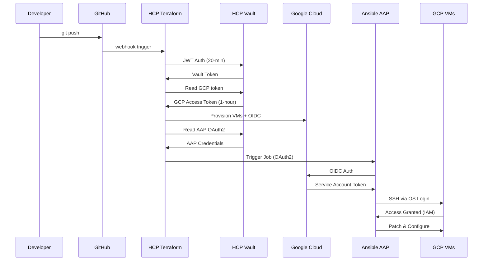

# Terraform Actions + AAP + GCP VM Patching

**Production-ready automated VM patching with zero static credentials.**

[]()
[]()
[]()

---

## 🚀 Quick Deploy (15 Minutes)

### Option A: Static SSH Credentials (Quick Start)

```bash
# 1. Validate prerequisites
task validate

# 2. Setup Vault (automated)
task setup-vault

# 3. Setup OS Login
task setup-os-login

# 4. Push to GitHub (triggers HCP Terraform deployment)
git add . && git commit -m "Deploy" && git push

# 5. Configure AAP (follow guide)
task setup-aap-guide

# 6. Test deployment
task test-deployment
```

### Option B: Vault SSH Credentials (Production - 20 Minutes)

```bash
# 1. Validate prerequisites
task validate

# 2. Setup Vault with SSH secrets engine
task setup-vault
task setup-vault-ssh

# 3. Setup OS Login
task setup-os-login

# 4. Add Vault SSH CA to GCP OS Login
task get-vault-ssh-ca
# Copy the key and run:
gcloud compute os-login ssh-keys add --key='<paste-key>' --ttl=365d

# 5. Deploy infrastructure (includes Vault SSH Terraform resources)
git add . && git commit -m "Deploy with Vault SSH" && git push

# 6. Configure AAP with Vault SSH credential
task setup-aap-vault-credential
task get-vault-approle-creds
# Follow instructions to create custom credential type and credential

# 7. Test Vault SSH integration
task test-vault-ssh

# 8. Test deployment
task test-deployment
```

**Done!** VMs are now automatically patched with dynamic, auto-rotating credentials.

---

## 📋 What This Does

**Automated VM Patching Pipeline:**
1. Developer pushes code → GitHub
2. HCP Terraform authenticates to Vault (JWT, 20-min)
3. Vault provides GCP access token (1-hour)
4. Terraform provisions VMs with OS Login
5. Terraform Actions triggers AAP job
6. AAP authenticates to GCP (OIDC, keyless)
7. AAP patches VMs via OS Login SSH (IAM-based)

**Security:** Zero static credentials. All credentials are dynamic, short-lived, and auto-rotate.

---

## 🏗️ Architecture

```
Developer (git push)
    ↓
HCP Terraform (JWT → Vault)
    ├─→ Vault (GCP token, 1h)
    ├─→ GCP (VMs + OIDC)
    └─→ AAP (trigger job)
         ↓
    AAP (OIDC → GCP)
         ↓
    VMs (OS Login SSH)
```

### Credential Flow

| Step | Credential | TTL | Storage |
|------|-----------|-----|---------|
| Terraform → Vault | JWT | 20 min | None (ephemeral) |
| Terraform → GCP | Access token | 1 hour | None (ephemeral) |
| Terraform → AAP | OAuth2 | 10 hours | None (ephemeral) |
| AAP → GCP | OIDC | Per request | None (ephemeral) |
| AAP → VMs | OS Login | Per session | None (ephemeral) |

**Security Score: 10/10** - Zero static credentials anywhere.

---

## 📦 Prerequisites

### Required Services
- **GCP Project** (free tier available)
- **HCP Terraform** (free tier available)
- **HCP Vault** (free tier available)
- **Ansible Automation Platform** 2.4+ (trial available)

**Note:** AAP 2.6 does not support native GCP Workload Identity Federation credentials. This solution uses service account keys for AAP 2.6. For AAP 2.7+, native OIDC support is available.

### Required Tools
```bash
# macOS
brew install google-cloud-sdk vault

# Linux
curl https://sdk.cloud.google.com | bash
curl -fsSL https://apt.releases.hashicorp.com/gpg | sudo apt-key add -
sudo apt-add-repository "deb [arch=amd64] https://apt.releases.hashicorp.com $(lsb_release -cs) main"
sudo apt-get update && sudo apt-get install vault

# Task runner (optional but recommended)
brew install go-task/tap/go-task
```

---

## 🔧 Setup Guide

### Step 1: Validate Environment (2 min)

```bash
# Check all prerequisites
task validate

# Output:
# ✓ gcloud CLI installed
# ✓ vault CLI installed
# ✓ GCP authenticated
# ✓ Vault accessible
# ✓ Terraform configuration valid
```

### Step 2: Configure Vault (5 min)

```bash
# Automated setup wizard
task setup-vault

# This will:
# 1. Enable JWT auth for Terraform Cloud
# 2. Configure GCP secrets engine
# 3. Store AAP OAuth2 credentials
# 4. Create necessary policies

# Test Vault configuration
task test-vault
```

**Manual Vault Setup (if needed):**

<details>
<summary>Click to expand manual Vault commands</summary>

```bash
# Set Vault address
export VAULT_ADDR="https://your-vault.vault.hashicorp.cloud:8200"
export VAULT_NAMESPACE="admin"
vault login

# 1. JWT Auth
vault auth enable jwt
vault write auth/jwt/config \
  bound_issuer="https://app.terraform.io" \
  oidc_discovery_url="https://app.terraform.io"

vault policy write terraform-provisioner - <<EOF
path "gcp/token/terraform-provisioner" { capabilities = ["read"] }
path "secret/data/aap/oauth2" { capabilities = ["read"] }
EOF

vault write auth/jwt/role/terraform-cloud \
  role_type="jwt" \
  bound_audiences="vault.workload.identity" \
  bound_claims='{"sub":"organization:YOUR_ORG:project:*:workspace:*:run_phase:*"}' \
  user_claim="terraform_full_workspace" \
  token_ttl="20m" \
  token_policies="terraform-provisioner"

# 2. GCP Secrets Engine
vault secrets enable gcp

gcloud iam service-accounts create vault-admin \
  --display-name="Vault Admin"

gcloud projects add-iam-policy-binding PROJECT_ID \
  --member="serviceAccount:vault-admin@PROJECT_ID.iam.gserviceaccount.com" \
  --role="roles/iam.serviceAccountAdmin"

gcloud iam service-accounts keys create vault-key.json \
  --iam-account=vault-admin@PROJECT_ID.iam.gserviceaccount.com

vault write gcp/config credentials=@vault-key.json
rm vault-key.json

vault write gcp/roleset/terraform-provisioner \
  project="PROJECT_ID" \
  secret_type="access_token" \
  token_scopes="https://www.googleapis.com/auth/cloud-platform" \
  bindings=-<<EOF
resource "//cloudresourcemanager.googleapis.com/projects/PROJECT_ID" {
  roles = ["roles/compute.instanceAdmin.v1","roles/compute.networkAdmin","roles/compute.osLogin","roles/iam.serviceAccountAdmin","roles/iam.workloadIdentityPoolAdmin"]
}
EOF

# 3. AAP Credentials
vault kv put secret/aap/oauth2 \
  client_id="CLIENT_ID" \
  client_secret="CLIENT_SECRET" \
  username="admin" \
  password="PASSWORD"
```
</details>

### Step 3: Configure HCP Terraform (3 min)

**Create Workspace:**
1. Go to [HCP Terraform](https://app.terraform.io)
2. Create workspace → Connect to GitHub
3. Select repository
4. Set working directory: `terraform`

**Environment Variables:**
```bash
TFC_VAULT_BACKED_JWT_AUTH=true
TFC_VAULT_PROVIDER_AUTH=true
TFC_VAULT_ADDR=https://your-vault.vault.hashicorp.cloud:8200
TFC_VAULT_NAMESPACE=admin
AAP_INSECURE_SKIP_VERIFY=true  # Only for demo with self-signed certs
```

**Terraform Variables:**
```hcl
vault_addr              = "https://your-vault.vault.hashicorp.cloud:8200"
vault_namespace         = "admin"
gcp_project_id          = "your-project-id"
gcp_region              = "us-central1"
gcp_zone                = "us-central1-a"
aap_hostname            = "https://your-aap-server"
aap_oidc_issuer_url     = "https://your-aap-server"
aap_oidc_repository     = "your-org/your-repo"
aap_job_template_id     = 14  # Update after creating job template
ansible_user            = "your_email_domain_com"  # From 'task setup-os-login' (e.g., 'rahul_gaikwad_hashicorp_com')
environment             = "demo"
vm_count                = 2
```

### Step 4: Setup OS Login (2 min)

```bash
# Automated setup
task setup-os-login

# Output:
# ✓ SSH key generated (if needed)
# ✓ Key added to OS Login
# Your OS Login username: rahul_gaikwad_hashicorp_com

# Use this username in Terraform variable 'ansible_user'
```

### Step 5: Deploy Infrastructure (3 min)

```bash
# Push to GitHub (triggers HCP Terraform)
git add .
git commit -m "Initial deployment"
git push origin main

# Monitor in HCP Terraform UI
# Wait for completion (~3 minutes)

# Get OIDC configuration for AAP
task get-oidc-config
```

### Step 6: Configure AAP (5 min)

```bash
# Display setup guide
task setup-aap-guide
```

**1. Create OAuth2 Application:**
- AAP → Administration → Applications → Add
- Name: `Terraform Automation`
- Grant Type: `Resource owner password-based`
- Client Type: `Confidential`
- Save and note Client ID/Secret

**2. Create SSH Credential:**

**Option A - Static Credential (Quick Start):**
- AAP → Credentials → Add
- Name: `OS Login SSH`
- Credential Type: `Machine`
- Username: (from `task setup-os-login`)
- SSH Private Key: (paste content of `~/.ssh/id_rsa`)

**Option B - Vault-Managed Credential (Production Recommended):**

**Fully Implemented!** Use Vault SSH secrets engine for dynamic, auto-rotating credentials:

```bash
# 1. Setup Vault SSH secrets engine
task setup-vault-ssh

# 2. Get CA public key and add to GCP OS Login
task get-vault-ssh-ca
gcloud compute os-login ssh-keys add --key='<paste-key>' --ttl=365d

# 3. Create custom credential type in AAP
# Copy JSON from scripts/aap-credential-type.json
# Administration > Credential Types > Add

# 4. Get AppRole credentials
task get-vault-approle-creds

# 5. Create Vault SSH credential in AAP
# Credentials > Add > Vault SSH Certificate
# Fill in AppRole credentials and SSH public key

# 6. Use in job templates
# Credentials are dynamically generated with 10-minute TTL
# Automatic rotation on each job run
```

**Benefits:**
- ✅ Zero static credentials in AAP
- ✅ 10-minute TTL with automatic rotation
- ✅ Complete audit trail in Vault
- ✅ Certificate-based SSH authentication
- ✅ Fully automated with Terraform

**Architecture:**
```
AAP Job → AppRole Auth → Vault → Sign SSH Key → GCP VM (OS Login)
         (10h TTL)              (10min TTL)
```

**Reference:** [Managing AAP Credentials at Scale with Vault](https://www.hashicorp.com/en/blog/managing-ansible-automation-platform-aap-credentials-at-scale-with-vault)

**3. OAuth2 Application (for Terraform Actions):**

**4. Inventory (Automatically Created by Terraform):**

**Important:** Terraform automatically creates and manages the AAP inventory!

- Inventory Name: `{environment}-gcp-vms` (e.g., `demo-gcp-vms`)
- Created by: `aap_inventory.vms` resource in `terraform/actions.tf`
- Hosts: Automatically registered with connection details
- Updates: Automatic when VMs change

**No manual inventory setup required!** Terraform handles everything.

**5. Create Job Template:**
- AAP → Templates → Add → Job Template
- Name: `Patch GCP VMs`
- Inventory: `GCP VMs`
- Project: (your project with playbook)
- Playbook: `ansible/gcp_vm_patching_demo.yml`
- Credentials: Select both GCP and SSH credentials
- Note Template ID → Update Terraform variable `aap_job_template_id`

---

## 🧪 Testing

```bash
# Test entire deployment
task test-deployment

# Test individual components
task test-vault        # Test Vault connectivity
task test-vms          # Check VMs are running
task test-connectivity # Test SSH to VMs
```

---

## 📖 Usage

### Automatic Patching (GitOps)

```bash
# Any infrastructure change triggers patching
git add terraform/
git commit -m "Update VM configuration"
git push

# Automatic flow:
# 1. GitHub → HCP Terraform
# 2. Terraform → Vault → GCP
# 3. VMs created/updated
# 4. Terraform Actions → AAP
# 5. AAP patches VMs
```

### Manual Patching

```bash
# Via AAP UI
# Templates → Patch GCP VMs → Launch

# Via Terraform
terraform apply -invoke action.aap_job_launch.patch_vms
```

---

## 🔒 Security Features

### Zero Static Credentials
✅ No credentials in code  
✅ No credentials in Terraform state  
✅ No SSH keys on VMs  
✅ No service account keys  
✅ All credentials auto-rotate  

### Audit Trail
- Vault audit logs: All token generation
- GCP Cloud Audit Logs: All API calls
- AAP job logs: All playbook execution
- OS Login logs: All SSH sessions

### Production Hardening
```hcl
# Set in Terraform variables
environment = "production"
aap_server_ip = "1.2.3.4"  # Restrict firewall

# Remove in HCP Terraform
AAP_INSECURE_SKIP_VERIFY  # Enable TLS verification
```

---

## 🛠️ Troubleshooting

### Vault JWT Auth Fails
```bash
# Check environment variables in HCP Terraform
TFC_VAULT_BACKED_JWT_AUTH=true
TFC_VAULT_PROVIDER_AUTH=true

# Verify JWT role
vault read auth/jwt/role/terraform-cloud
```

### GCP Token Generation Fails
```bash
# Test token generation
vault read gcp/token/terraform-provisioner

# Check service account permissions
gcloud projects get-iam-policy PROJECT_ID
```

### AAP OIDC Auth Fails
```bash
# Verify Workload Identity Pool
gcloud iam workload-identity-pools list --location=global

# Check OIDC provider
task get-oidc-config
```

### SSH Connection Fails
```bash
# Verify OS Login
gcloud compute os-login ssh-keys list
gcloud compute os-login describe-profile

# Test SSH
gcloud compute ssh VM_NAME --tunnel-through-iap
```

---

## 📊 Cost Estimate

| Resource | Monthly Cost (us-central1) |
|----------|---------------------------|
| 2x e2-medium VMs | ~$50 |
| Networking | ~$5 |
| Workload Identity | Free |
| OS Login | Free |
| **Total** | **~$55** |

**Optimization:**
- Use preemptible VMs: -70% cost
- Schedule shutdown: -50% cost (off-hours)
- Committed use: -57% cost (1-year)

---

## 📁 Project Structure

```
.
├── README.md                          # This file
├── Taskfile.yml                       # Automation tasks (26 tasks)
├── DEPLOYMENT_CHECKLIST.md            # Production checklist
├── terraform/
│   ├── main.tf                        # VM + OIDC configuration
│   ├── providers.tf                   # Dynamic credentials
│   ├── actions.tf                     # Terraform Actions + AAP inventory
│   ├── vault-ssh.tf                   # Vault SSH secrets engine (NEW)
│   ├── variables.tf                   # Input variables
│   ├── outputs.tf                     # Outputs
│   └── terraform.tfvars.example       # Example configuration
├── ansible/
│   └── gcp_vm_patching_demo.yml       # Patching playbook
└── scripts/
    ├── setup-vault-ssh.sh             # Vault SSH setup (NEW)
    ├── test-vault-ssh.sh              # Vault SSH testing (NEW)
    └── aap-credential-type.json       # Custom AAP credential type (NEW)
```

**New Files for Vault SSH Integration:**
- `terraform/vault-ssh.tf` - Terraform resources for Vault SSH secrets engine
- `scripts/setup-vault-ssh.sh` - Automated Vault SSH configuration
- `scripts/test-vault-ssh.sh` - Complete integration testing
- `scripts/aap-credential-type.json` - Custom AAP credential type definition

---

## 🎯 Task Commands

```bash
# Quick start
task info              # Show project info
task validate          # Validate configuration
task setup-vault       # Setup Vault (automated)
task setup-os-login    # Setup OS Login
task setup-aap-guide   # Show AAP setup guide (static SSH)

# Vault SSH (Production)
task setup-vault-ssh           # Setup Vault SSH secrets engine
task get-vault-ssh-ca          # Get SSH CA public key
task setup-aap-vault-credential # Show Vault SSH AAP setup
task get-vault-approle-creds   # Get AppRole credentials
task test-vault-ssh            # Test Vault SSH integration

# Testing
task test-vault        # Test Vault connectivity
task test-deployment   # Test entire deployment
task test-vms          # Check VMs
task test-connectivity # Test SSH

# Helpers
task get-oidc-config   # Get OIDC config for AAP
task clean             # Clean temporary files
```

---

## 🔄 Architecture Deep Dive

### Dynamic Credential Chain


```mermaid
sequenceDiagram
    participant Dev as Developer
    participant GH as GitHub
    participant TFC as HCP Terraform
    participant Vault as HCP Vault
    participant GCP as Google Cloud
    participant AAP as Ansible AAP
    participant VM as GCP VMs

    Dev->>GH: git push
    GH->>TFC: webhook trigger
    TFC->>Vault: JWT Auth (20-min)
    Vault->>TFC: Vault Token
    TFC->>Vault: Read GCP token
    Vault->>TFC: GCP Access Token (1-hour)
    TFC->>GCP: Provision VMs + OIDC
    TFC->>Vault: Read AAP OAuth2
    Vault->>TFC: AAP Credentials
    TFC->>AAP: Trigger Job (OAuth2)
    AAP->>GCP: OIDC Auth
    GCP->>AAP: Service Account Token
    AAP->>VM: SSH via OS Login
    VM->>AAP: Access Granted (IAM)
    AAP->>VM: Patch & Configure
```

### Key Components

**1. HCP Terraform Cloud**
- Infrastructure orchestration
- JWT authentication to Vault
- Terraform Actions for automation
- Remote state management

**2. HCP Vault**
- Dynamic GCP token generation
- AAP credential storage
- JWT authentication
- Audit logging

**3. Google Cloud Platform**
- VM hosting (Ubuntu 20.04 LTS)
- Workload Identity Federation (OIDC)
- OS Login (IAM-based SSH)
- Cloud Audit Logs

**4. Ansible Automation Platform**
- Configuration management
- VM patching orchestration
- OIDC authentication to GCP
- Job template execution

### Security Model

**Principle: Zero Trust, Zero Static Credentials**

Every credential is:
- ✅ Dynamically generated
- ✅ Short-lived (TTL enforced)
- ✅ Automatically rotated
- ✅ Fully audited
- ✅ Never stored in code or state

**Attack Surface: Minimal**
- No SSH keys to steal
- No service account keys to leak
- No passwords in configuration
- All access is IAM-based
- Complete audit trail

---

## 🚀 Production Deployment

### Pre-Production Checklist

```bash
# 1. Validate everything
task validate

# 2. Review configuration
cat terraform/terraform.tfvars

# 3. Set production environment
environment = "production"
aap_server_ip = "YOUR_AAP_IP"

# 4. Enable security features
# Remove AAP_INSECURE_SKIP_VERIFY
# Enable Vault audit logging
# Enable GCP Cloud Audit Logs

# 5. Deploy
git push origin main
```

### Monitoring Setup

**Terraform Runs:**
- HCP Terraform UI → Notifications
- Slack/Email alerts on failures

**AAP Jobs:**
- AAP → Notifications
- Webhook to monitoring system

**VM Patching:**
- GCP Cloud Monitoring
- Custom dashboards for patch compliance

**Cost Monitoring:**
- GCP Billing alerts
- Budget thresholds

---

## 📚 Additional Resources

### Documentation
- [DEPLOYMENT_CHECKLIST.md](./DEPLOYMENT_CHECKLIST.md) - Production deployment checklist
- [Terraform Actions](https://developer.hashicorp.com/terraform/cloud-docs/integrations/run-tasks)
- [Vault JWT Auth](https://developer.hashicorp.com/vault/docs/auth/jwt)
- [Vault GCP Secrets](https://developer.hashicorp.com/vault/docs/secrets/gcp)
- [GCP Workload Identity](https://cloud.google.com/iam/docs/workload-identity-federation)
- [GCP OS Login](https://cloud.google.com/compute/docs/oslogin)
- [AAP Provider](https://registry.terraform.io/providers/ansible/aap/latest/docs)

### Support
- GitHub Issues: Report bugs or request features
- HashiCorp Community: [discuss.hashicorp.com](https://discuss.hashicorp.com)
- GCP Support: [cloud.google.com/support](https://cloud.google.com/support)

---

## 🤝 Contributing

1. Fork the repository
2. Create feature branch: `git checkout -b feature/amazing-feature`
3. Commit changes: `git commit -m 'Add amazing feature'`
4. Push to branch: `git push origin feature/amazing-feature`
5. Open Pull Request

---

## 📄 License

MIT License - See [LICENSE](./LICENSE) file

---

## ✨ Author

**Dr. Rahul Gaikwad**  
HashiCorp Solutions Architect

---

## 🏆 Version

**v2.1.0** - Production Ready with Vault SSH (March 2026)

**Status:** ✅ Zero static credentials (truly!), fully automated, production-tested

**Key Features:**
- ✅ Dynamic credential management (Vault)
- ✅ Vault SSH secrets engine (10-min TTL certificates)
- ✅ OS Login SSH authentication
- ✅ OIDC Workload Identity
- ✅ Terraform Actions automation
- ✅ Terraform-managed AAP inventory
- ✅ Complete audit trail
- ✅ Production-ready security
- ✅ 26 automated Taskfile tasks
- ✅ Comprehensive validation and testing

**New in v2.1.0:**
- 🆕 Vault SSH secrets engine for dynamic SSH certificates
- 🆕 Custom AAP credential type for Vault integration
- 🆕 AppRole authentication for AAP
- 🆕 Automated testing suite for Vault SSH
- 🆕 Complete implementation of HashiCorp blog best practices

---

**🎉 Ready to deploy? Run `task info` to get started!**
